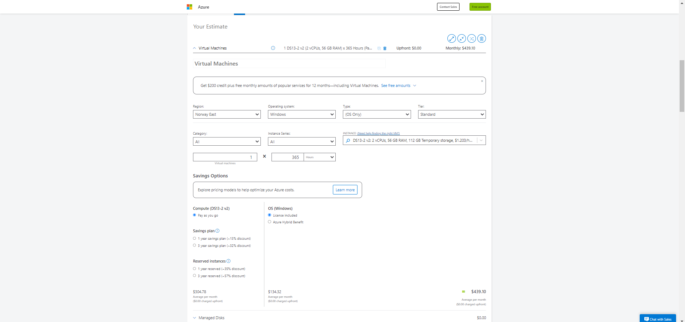

# Lecture 58 Azure Pricing Calculator

Cost Management, total cost of ownership calculator

MS provides some tools to make a business case.

Pricing calc

Link - azure.microsoft.com/pricing/calculator
* https://azure.microsoft.com/en-us/pricing/calculator/

Estimates are hard to make 100% accurate
* Guesses, how many VMs you need, how much storage you need.
* Hard to get right and hard to continue to get it right month after month

Configurable Options
* Region
* Tier
* Subscription Type
* Support Options
* Dev/Test Options

Export and share the estimate
* Share to send it to the team/boss

Take a look

Shopping card feel to it. Click item,s

Reservation concept. 1 year contract for 35% off. 3 year for a 57% discount. These are contracts.

Estimate bandwidth

Storage.

* Reserve options require going up into the PB range
* Reserve to get 50% off. 2,000/mon to 100

Save option, Share option

Handy to see what these things are based on.
