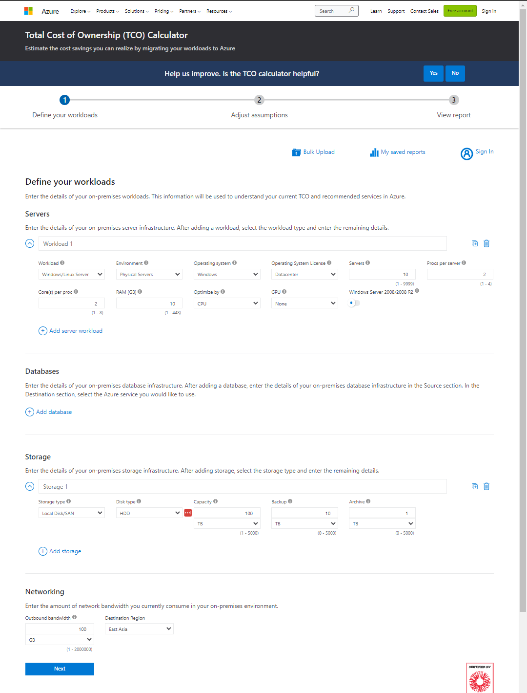
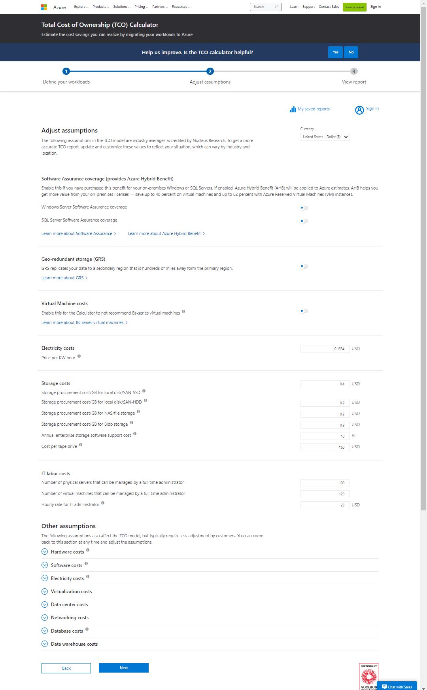
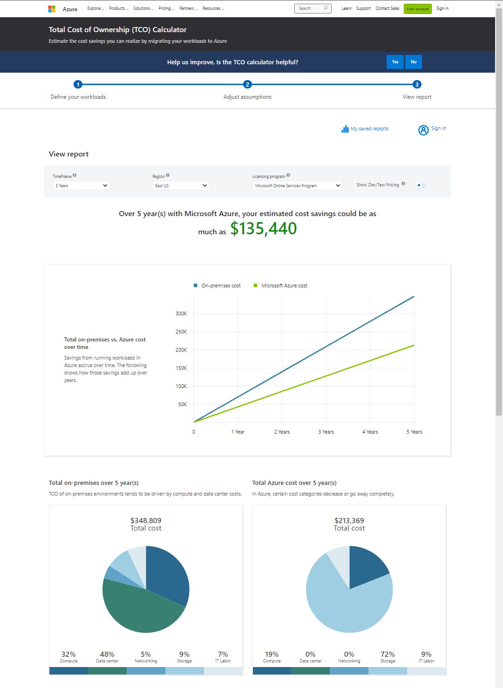
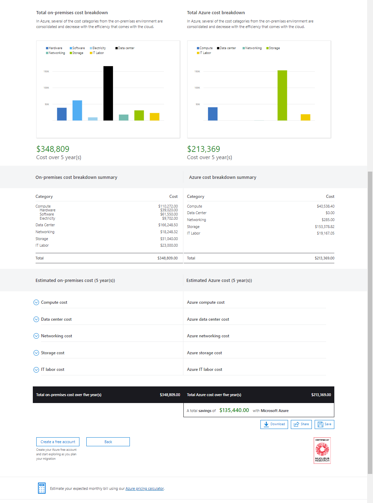

# Lecture 59 Total Cost of Ownership Calculator

TCO calculator

Focuses on the other costs other than the costs of the applications

Other costs
* Electricity
* Cooling
* Internet connectivity
* Rack space
* Labor to setup
* Maintenance labor
* Backup(s)

Link - https://azure.microsoft.com/en-us/pricing/tco/calculator/

Define workload

Adjust assumptions:

Keep insurance, GRS off

Tweak electricity. Tweak how much a server goes for.

Sometimes it shows you a ton of savings, sometimes not - little finicky

Estimation breakdown that comes up to the 6 figure savings
