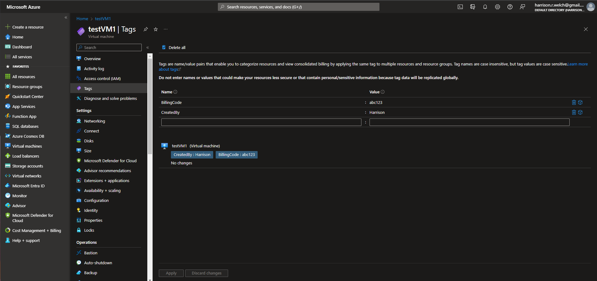

# Lecture 61 Resource Tags

Seen this when creating VMs and storage accounts

Example:

This is a way to add meta data for you own personal use.

Example after creation:

People may forget why a VM is made. May forget who gets billed.

Helps with billing and support issues.

Reports can be generated "by tag"

Example report cost by tag "createdby":"harrison"

Don't have to use them, but are a good way for large organizations from tracking.

Quick demo. Tags in the left bound menu.

Name and Value pairs (examples)
* CreatedBy - Harrison
* billingCode - a7719-7901

Cost analysis (reports)
* Filter by resources created by myself

