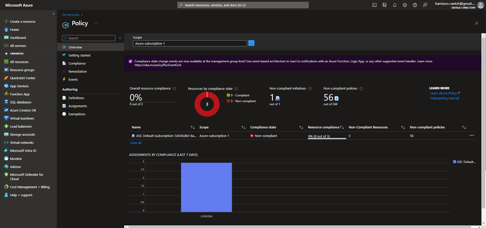
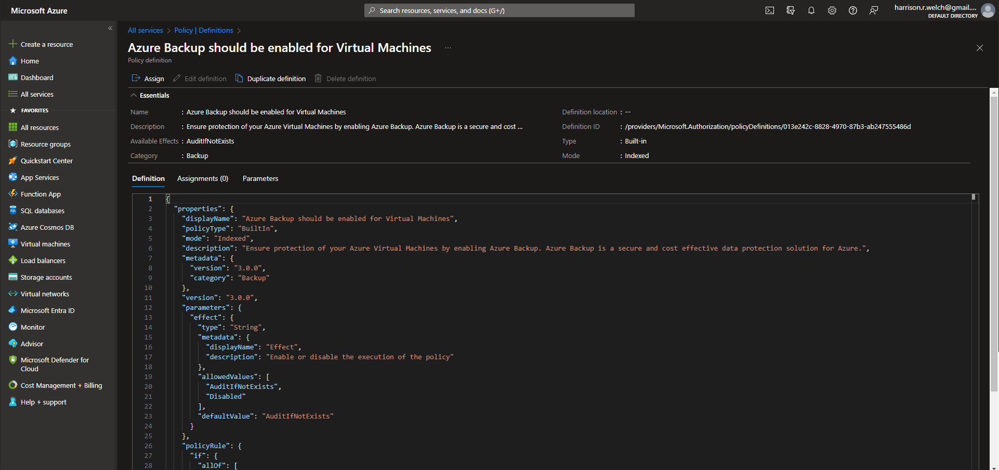
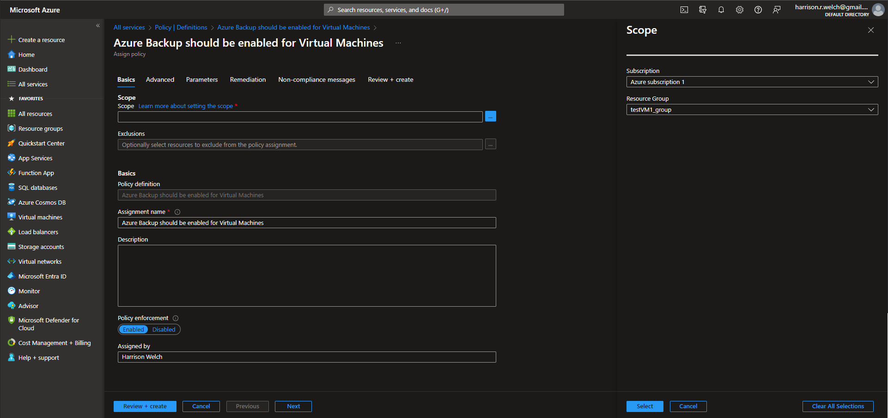
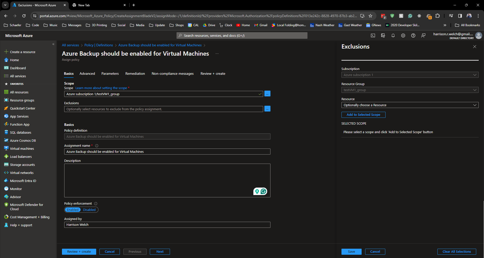
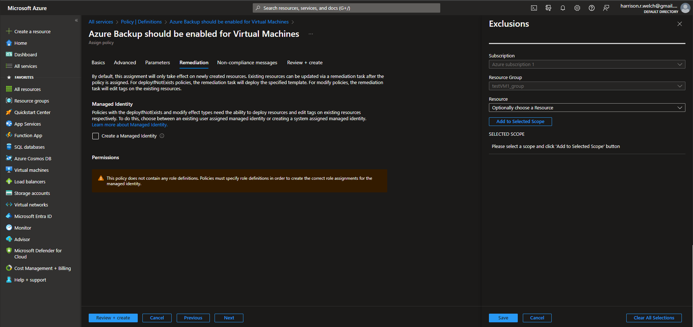
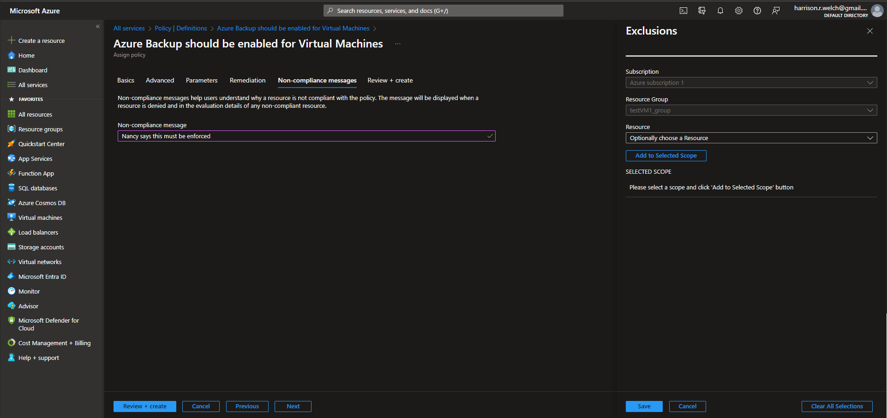
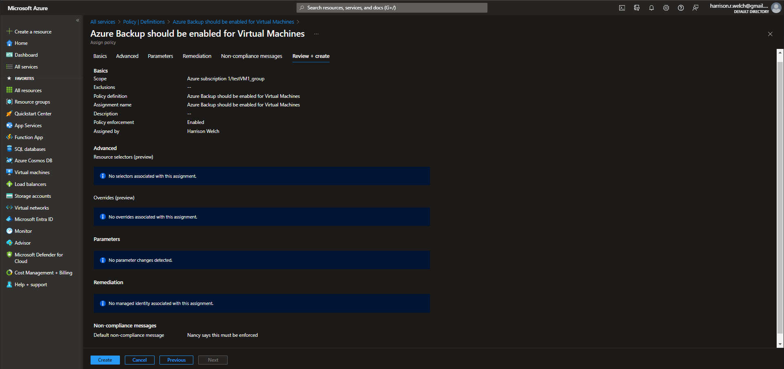

# Lecture 65 DEMO Azure Policy

https://portal.azure.com/#view/Microsoft_Azure_Policy/PolicyMenuBlade/~/Overview

May have to search for it.

Authoring
-> Definitions

May take up to 30 seconds to load. 100s and 100s of Policies

Filter by "backup"

Find "Azure Backup should be enabled for Virtual Machines"

Click "assign" to assign it to a "scope"

Scope applies to subscriptions, management groups, or resource groups

Can exclude certain resources.

Advanced tab will allow for only using specific resources and Allow for overrides

Remediation tab shows that this policy will only apply to newly created resources. "Existing resources can be updated via a remediation task".

Compliance Message - this text will display if a resource is out of compliance

Review and Create

With so many policies built-in they will have something in mind for what you want to enforce
