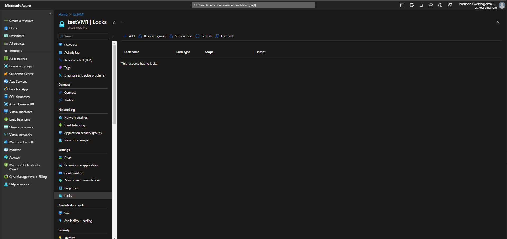
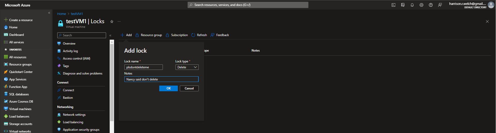
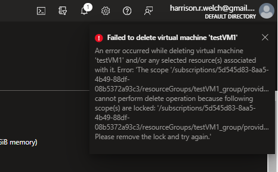

# Lecture 66 Resource Locks

Another way you can enforce rules is Locks:
* Read Only
* Can Not Delete

Simple lock

Going into resource and demonstrate

Container register and I don't want anyone to delete it.

Settings -> Locks -> Add
* give it a name - "Do not delete me"

Name: donotdeleteme
Lock Type: Delete
Scope: `<resource-type-and-name>`
Notes: "Bob says do not delete"

Going back to the resource and attempting to delete it will throw up an error message

It is true that you can simply remove the lock BUT you can also simply not grant the ability to audit locks to most users.

If you don't have authority to delete the "delete" lock then problem solved.

----

If you try to delete with a lock on it:

