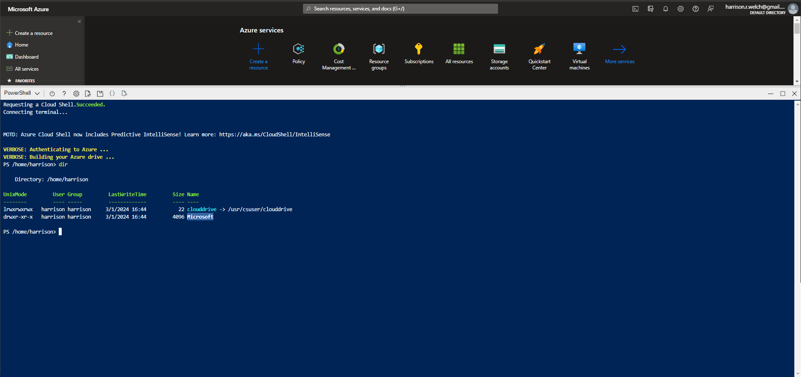

# Lecture 68 Azure Portal and Command Line Tools

2nd to last section

Azure Tools
* Azure CLI
* Powershell
* Azure Portal
* Azure Cloud Shell
* Azure Mobile App

Azure Portal
* Lots of examples
* Web based application that allows you to see running resources
* User friendly - graphs
* Make fine-grain modifications

(Up to a certain scale)

PowerShell and CLI Command Line
* Manage things at scale
* PowerShell and CLI (Bash) are tools you cna use to manage Azure

Top Menu has the ">_" symbol


This opens up the little window for "Cloud Shell"

Can switch to "Bash" for more Linux-based commands

"dir" to see the directory



Teacher - Switch to Bash

"az functionapp list"

```
[]
```

"az webapp list"

```
[
    {
        ...
    }
]
```

Return JSON of all running Webapps

I can run commands on this command line.

You can write and run scripts for that.
* Create VM - can be run each time to make a VM
  * Same every time
* Source control can help maintain this in a company

----

Example run in Bash shell

```

Requesting a Cloud Shell.Succeeded. 
Connecting terminal...

harrison [ ~ ]$ az functionapp list
[]
harrison [ ~ ]$ az webapp list
[]
harrison [ ~ ]$ az vm list
[Warning] This output may compromise security by showing the following secrets: linuxConfiguration, keyData, publicKeys, ssh, osProfile. Learn more at: https://go.microsoft.com/fwlink/?linkid=2258669
[
  {
    "additionalCapabilities": {
      "hibernationEnabled": false,
      "ultraSsdEnabled": null
    },
    "applicationProfile": null,
    "availabilitySet": null,
    "billingProfile": null,
    "capacityReservation": null,
    "diagnosticsProfile": {
      "bootDiagnostics": {
        "enabled": true,
        "storageUri": null
      }
    },
    "etag": null,
    "evictionPolicy": null,
    "extendedLocation": null,
    "extensionsTimeBudget": null,
    "hardwareProfile": {
      "vmSize": "Standard_B1s",
      "vmSizeProperties": null
    },
    "host": null,
    "hostGroup": null,
    "id": "...",
    "identity": null,
    "instanceView": null,
    "licenseType": null,
    "location": "eastus",
    "managedBy": null,
    "name": "testVM1",
    "networkProfile": {
      "networkApiVersion": null,
      "networkInterfaceConfigurations": null,
      "networkInterfaces": [
        {
          "deleteOption": "Detach",
          "id": "...",
          "primary": null,
          "resourceGroup": "testVM1_group"
        }
      ]
    },
    "osProfile": {
      "adminPassword": null,
      "adminUsername": "azureuser",
      "allowExtensionOperations": true,
      "computerName": "testVM1",
      "customData": null,
      "linuxConfiguration": {
        "disablePasswordAuthentication": true,
        "enableVmAgentPlatformUpdates": false,
        "patchSettings": {
          "assessmentMode": "ImageDefault",
          "automaticByPlatformSettings": null,
          "patchMode": "ImageDefault"
        },
        "provisionVmAgent": true,
        "ssh": {
          "publicKeys": [
            {
              "keyData": "ssh-rsa ... generated-by-azure",
              "path": "/home/azureuser/.ssh/authorized_keys"
            }
          ]
        }
      },
      "requireGuestProvisionSignal": true,
      "secrets": [],
      "windowsConfiguration": null
    },
    "plan": null,
    "platformFaultDomain": null,
    "priority": null,
    "provisioningState": "Succeeded",
    "proximityPlacementGroup": null,
    "resourceGroup": "...",
    "resources": null,
    "scheduledEventsProfile": null,
    "securityProfile": {
      "encryptionAtHost": null,
      "encryptionIdentity": null,
      "proxyAgentSettings": null,
      "securityType": "TrustedLaunch",
      "uefiSettings": {
        "secureBootEnabled": true,
        "vTpmEnabled": true
      }
    },
    "storageProfile": {
      "dataDisks": [],
      "diskControllerType": "SCSI",
      "imageReference": {
        "communityGalleryImageId": null,
        "exactVersion": "20.04.202402280",
        "id": null,
        "offer": "0001-com-ubuntu-server-focal",
        "publisher": "canonical",
        "sharedGalleryImageId": null,
        "sku": "20_04-lts-gen2",
        "version": "latest"
      },
      "osDisk": {
        "caching": "ReadWrite",
        "createOption": "FromImage",
        "deleteOption": "Delete",
        "diffDiskSettings": null,
        "diskSizeGb": null,
        "encryptionSettings": null,
        "image": null,
        "managedDisk": {
          "diskEncryptionSet": null,
          "id": "...",
          "resourceGroup": "...",
          "securityProfile": null,
          "storageAccountType": null
        },
        "name": "...",
        "osType": "Linux",
        "vhd": null,
        "writeAcceleratorEnabled": null
      }
    },
    "tags": {
      "BillingCode": "abc123",
      "CreatedBy": "Harrison"
    },
    "timeCreated": "2024-02-29T20:02:12.356885+00:00",
    "type": "Microsoft.Compute/virtualMachines",
    "userData": null,
    "virtualMachineScaleSet": null,
    "vmId": "...",
    "zones": null
  }
]
harrison [ ~ ]$ 
```

Screenshot


