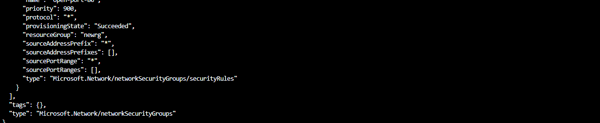

# Lecture_68_Azure_Portal_and_Command_Line_Tools.md

Azure Cloudshell.

First time you do have to create a storage account. Teach does not have to do this.

CLI - Command line interface

We are in Bash

By default you are logged into the Portal. Running this locally on the machine. You would have to login, b/c Azure does not know who you are.

Command:

```sh
az group create --name newrg --location eastus
```

Returns as JSON - JavaScript Object Notation.

```json
{
  "id": "/subscriptions/.../resourceGroups/newrg",
  "location": "eastus",
  "managedBy": null,
  "name": "newrg",
  "properties": {
    "provisioningState": "Succeeded"
  },
  "tags": null,
  "type": "Microsoft.Resources/resourceGroups"
}
```


If you stop here, look at the resource group "rg" is created


Next thing you can do is create a Virtual Machine.

Azure has made this easier recently.

Command:

```sh
az vm create --resource-group newrg --name newvm --image Win2019DataCenter --public-ip-sku Standard --admin-username azsjdtestuser
```

* This will infer defaults: CPU, Networking. Because they were not provided in the command with additional "flags"

Hit Enter, Give it an Admin password. Confirm by retyping that same password.

" \|/-\|/- Running"

Script is for running and rerun and rerun etc

Output:

```json
{
  "fqdns": "",
  "id": "/subscriptions/.../resourceGroups/newrg/providers/Microsoft.Compute/virtualMachines/newvm",
  "location": "eastus",
  "macAddress": "...",
  "powerState": "VM running",
  "privateIpAddress": "...",
  "publicIpAddress": "...",
  "resourceGroup": "newrg",
  "zones": ""
}
```


Command to open port:

`az vm open-port --port 80 --resource-group newrg --name newvm`

Running.

Spits out a bunch of details.

```json
{
  "defaultSecurityRules": [
    {
      ...
    }
  ],
  "etag": "W/\"...\"",
  "id": "/subscriptions/.../resourceGroups/newrg/providers/Microsoft.Network/networkSecurityGroups/newvmNSG",
  "location": "eastus",
  "name": "newvmNSG",
  "networkInterfaces": [
    {
      "id": "/subscriptions/.../resourceGroups/newrg/providers/Microsoft.Network/networkInterfaces/newvmVMNic",
      "resourceGroup": "newrg"
    }
  ],
  "provisioningState": "Succeeded",
  "resourceGroup": "newrg",
  "resourceGuid": "...",
  "securityRules": [
    {
      ...
    }
  ],
  "tags": {},
  "type": "Microsoft.Network/networkSecurityGroups"
}
```


...


Manipulate all of this stuff using the command line

Delete:

`az group delete --name newrg`

Example:


All of this from the command line
