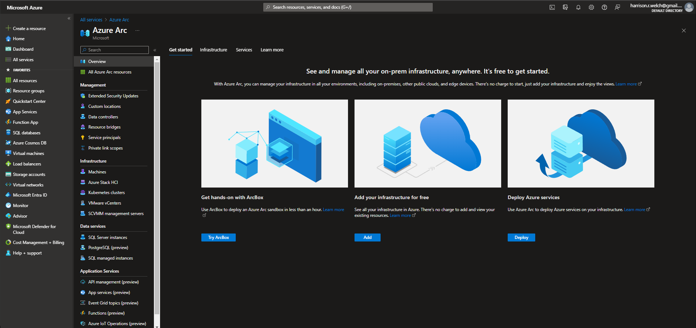
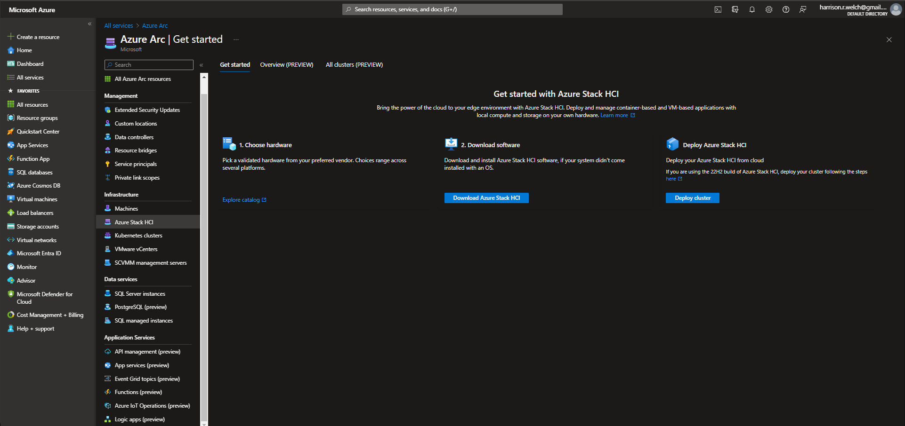
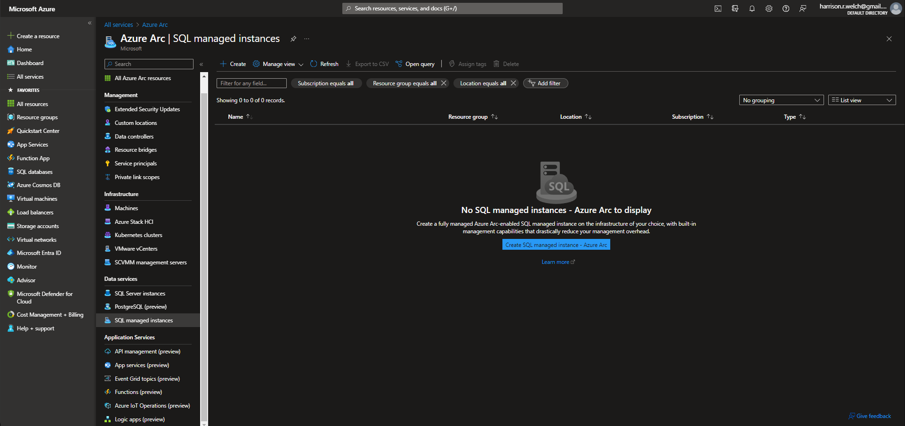

# Lecture 70 Azure Arc

Azure Arc. It's pretty New.

MS ignite 3 years it was announced.

Over time MS is starting to focus on this more.

Azure Arc allows you to see all on-prem infrastructure, anywhere.

Allows you to see and manage hybrid Infrastructure. Getting it to show up has no additional charge.
* Servers
* SQL Servers
* VM (Preview)
* Kubernetes

Arc can monitor the on-prem items.

Identify the cluster. Run a script which allows Arc to know that KB cluster exists.

Add Server instructions.

SQL Servers

Azure Stack
* Means Private Cloud
* HCI means "edge computing".
  * Not inside network but on the edge of it.

Data services
* SQL managed instances
* Manage like its in Azure

Applications (Preview)

Open query against DB

Arc can manage servers outside Azure as if they were inside Azure. Plus multi-cloud environments.
