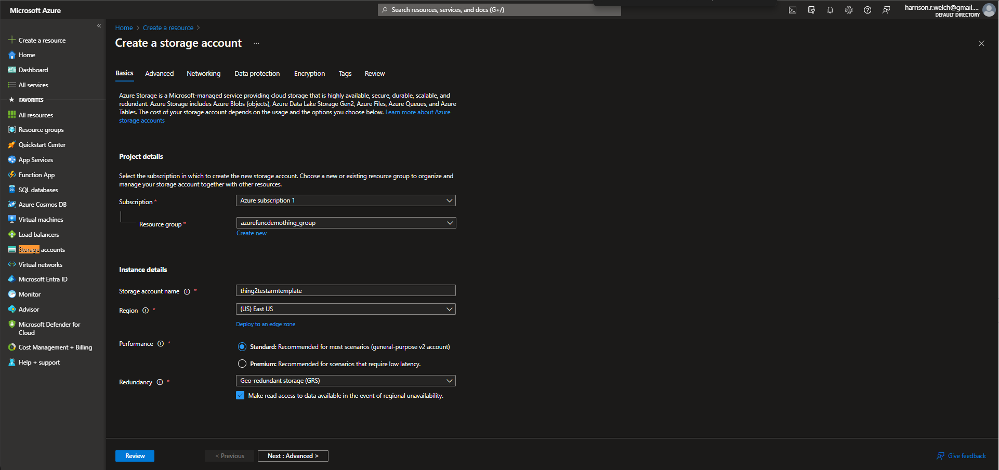
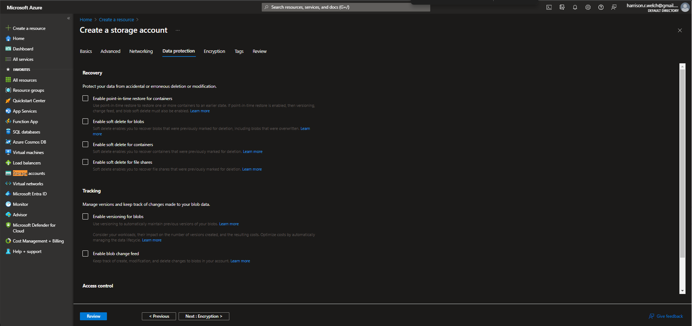
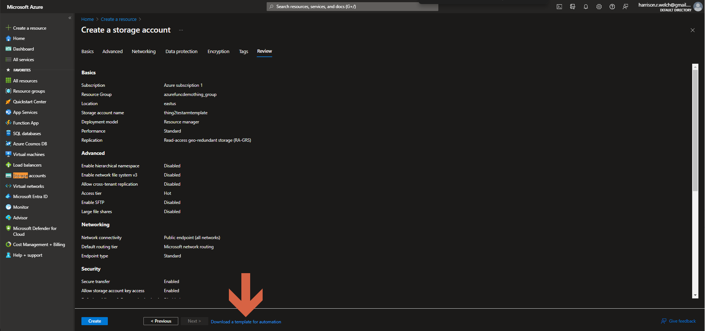
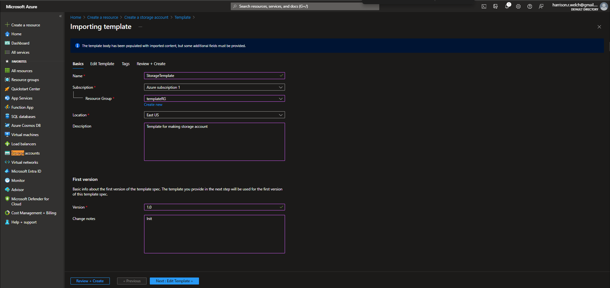
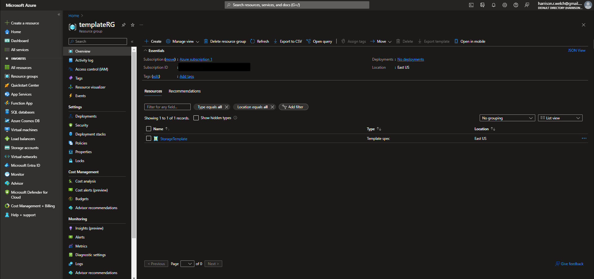
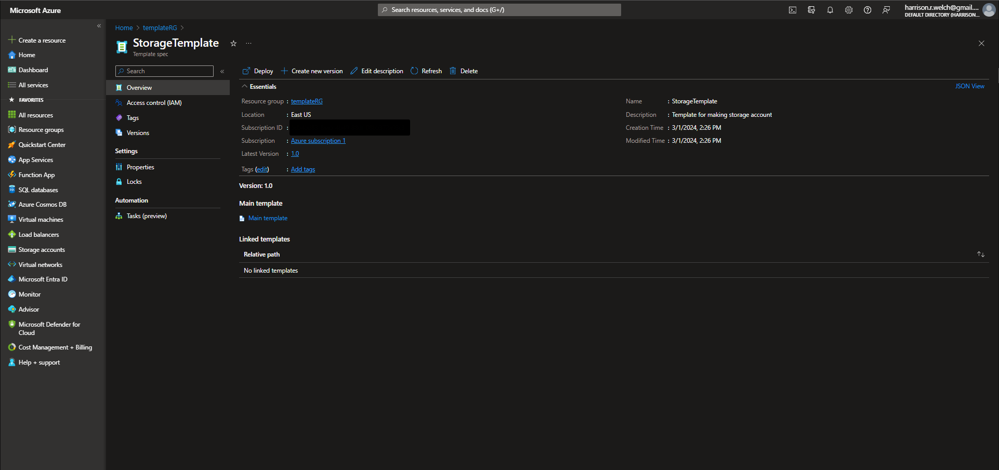
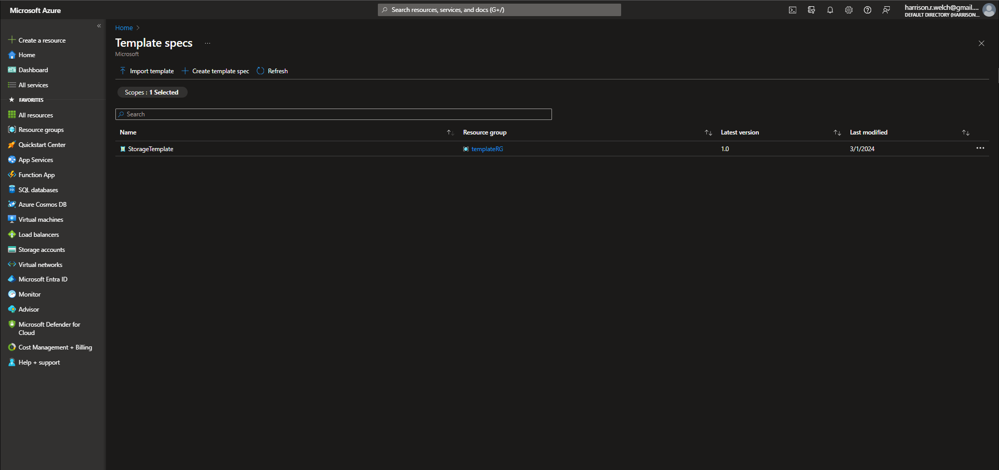

# Lecture 73 LIVE DEMO Generate ARM Templates in the Azure Portal

Create a resource -> Storage account for Demo



Storage account name must be unique
* azsjdarmdemo

Locally redundant

Turn off all soft delete



This is where you would normally create, instead select "Download template for automation" to the right.
* name is given from a parameters
* parmeters is a separate tab



Not very useful to just make a template here

```json
{
    "$schema": "http://schema.management.azure.com/schemas/2015-01-01/deploymentTemplate.json#",
    "contentVersion": "1.0.0.0",
    "parameters": {
        "location": {
            "type": "string"
        },
        "storageAccountName": {
            "type": "string"
        },
        "accountType": {
            "type": "string"
        },
        "kind": {
            "type": "string"
        },
        "minimumTlsVersion": {
            "type": "string"
        },
        "supportsHttpsTrafficOnly": {
            "type": "bool"
        },
        "allowBlobPublicAccess": {
            "type": "bool"
        },
        "allowSharedKeyAccess": {
            "type": "bool"
        },
        "defaultOAuth": {
            "type": "bool"
        },
        "accessTier": {
            "type": "string"
        },
        "publicNetworkAccess": {
            "type": "string"
        },
        "allowCrossTenantReplication": {
            "type": "bool"
        },
        "networkAclsBypass": {
            "type": "string"
        },
        "networkAclsDefaultAction": {
            "type": "string"
        },
        "dnsEndpointType": {
            "type": "string"
        },
        "keySource": {
            "type": "string"
        },
        "encryptionEnabled": {
            "type": "bool"
        },
        "keyTypeForTableAndQueueEncryption": {
            "type": "string"
        },
        "infrastructureEncryptionEnabled": {
            "type": "bool"
        },
        "isContainerRestoreEnabled": {
            "type": "bool"
        },
        "isBlobSoftDeleteEnabled": {
            "type": "bool"
        },
        "isContainerSoftDeleteEnabled": {
            "type": "bool"
        },
        "changeFeed": {
            "type": "bool"
        },
        "isVersioningEnabled": {
            "type": "bool"
        },
        "isShareSoftDeleteEnabled": {
            "type": "bool"
        }
    },
    "variables": {},
    "resources": [
        {
            "name": "[parameters('storageAccountName')]",
            "type": "Microsoft.Storage/storageAccounts",
            "apiVersion": "2022-05-01",
            "location": "[parameters('location')]",
            "properties": {
                "minimumTlsVersion": "[parameters('minimumTlsVersion')]",
                "supportsHttpsTrafficOnly": "[parameters('supportsHttpsTrafficOnly')]",
                "allowBlobPublicAccess": "[parameters('allowBlobPublicAccess')]",
                "allowSharedKeyAccess": "[parameters('allowSharedKeyAccess')]",
                "defaultToOAuthAuthentication": "[parameters('defaultOAuth')]",
                "accessTier": "[parameters('accessTier')]",
                "publicNetworkAccess": "[parameters('publicNetworkAccess')]",
                "allowCrossTenantReplication": "[parameters('allowCrossTenantReplication')]",
                "networkAcls": {
                    "bypass": "[parameters('networkAclsBypass')]",
                    "defaultAction": "[parameters('networkAclsDefaultAction')]",
                    "ipRules": []
                },
                "dnsEndpointType": "[parameters('dnsEndpointType')]",
                "encryption": {
                    "keySource": "[parameters('keySource')]",
                    "services": {
                        "blob": {
                            "enabled": "[parameters('encryptionEnabled')]"
                        },
                        "file": {
                            "enabled": "[parameters('encryptionEnabled')]"
                        },
                        "table": {
                            "enabled": "[parameters('encryptionEnabled')]"
                        },
                        "queue": {
                            "enabled": "[parameters('encryptionEnabled')]"
                        }
                    },
                    "requireInfrastructureEncryption": "[parameters('infrastructureEncryptionEnabled')]"
                }
            },
            "dependsOn": [],
            "sku": {
                "name": "[parameters('accountType')]"
            },
            "kind": "[parameters('kind')]",
            "tags": {}
        },
        {
            "name": "[concat(parameters('storageAccountName'), '/default')]",
            "type": "Microsoft.Storage/storageAccounts/blobServices",
            "apiVersion": "2022-05-01",
            "properties": {
                "restorePolicy": {
                    "enabled": "[parameters('isContainerRestoreEnabled')]"
                },
                "deleteRetentionPolicy": {
                    "enabled": "[parameters('isBlobSoftDeleteEnabled')]"
                },
                "containerDeleteRetentionPolicy": {
                    "enabled": "[parameters('isContainerSoftDeleteEnabled')]"
                },
                "changeFeed": {
                    "enabled": "[parameters('changeFeed')]"
                },
                "isVersioningEnabled": "[parameters('isVersioningEnabled')]"
            },
            "dependsOn": [
                "[concat('Microsoft.Storage/storageAccounts/', parameters('storageAccountName'))]"
            ]
        },
        {
            "name": "[concat(parameters('storageAccountName'), '/default')]",
            "type": "Microsoft.Storage/storageAccounts/fileservices",
            "apiVersion": "2022-05-01",
            "properties": {
                "protocolSettings": null,
                "shareDeleteRetentionPolicy": {
                    "enabled": "[parameters('isShareSoftDeleteEnabled')]"
                }
            },
            "dependsOn": [
                "[concat('Microsoft.Storage/storageAccounts/', parameters('storageAccountName'))]",
                "[concat(concat('Microsoft.Storage/storageAccounts/', parameters('storageAccountName')), '/blobServices/default')]"
            ]
        }
    ],
    "outputs": {}
}
```

But you can create to change the name ("1,2,3..." as the last character)

### Add to Library
* Creates a resource
* Called a template spec in the library

Name: "StorageTemplate"

ResourceGroup: "templateRG"

Verison Number is required. Put in "1.0" for example.



Go to "templateRG" resource group. Click on the armtemplate object.



View the template Spec



Did not keep parameters, reenter or upload

View all in the "Templates" menu

MS has moved on to "Template Specs"



Storing IaC, track changes over time.
