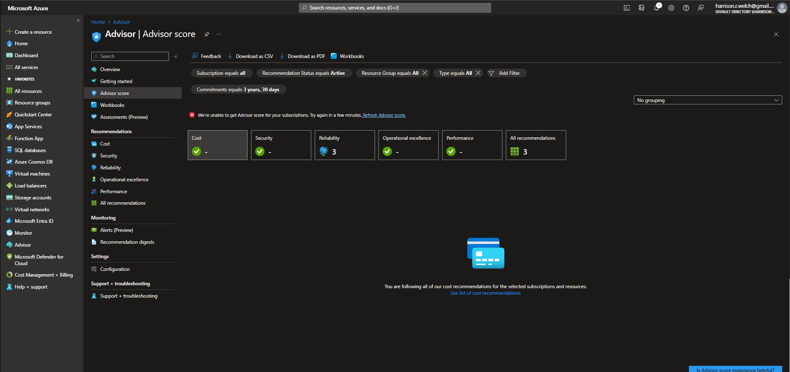
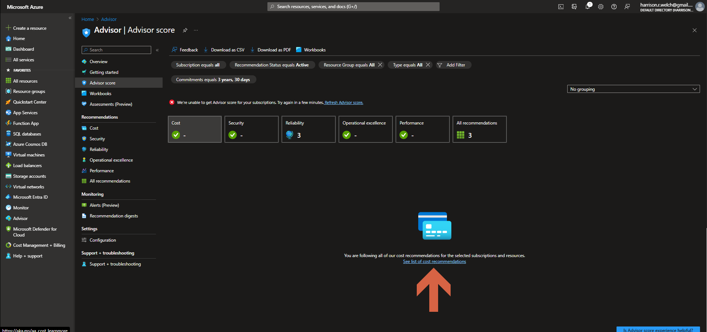
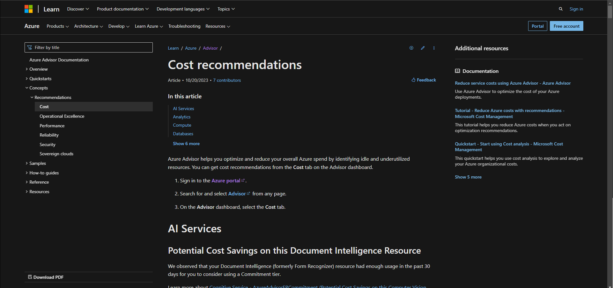

# Lecture 74 Azure Advisor and Azure Service Health

Over the years MS Azure has gotten better at managing your account.

Azure Advisor.
* https://portal.azure.com/#view/Microsoft_Azure_Expert/AdvisorMenuBlade/~/score
* Analyzes your account and sees if you can cut costs
* Similarly it can see the performance and make recommendations to upgrade
* Security recommended
  * Example - If the RDP port has been open for a long period of time w/out use.

Azure Service Health
* Not specific to your use of Azure
* More about how its running

See if there are services in certain zones are having issues.

The teacher's account might be a bit boring.

Blue cloud with a medal on it

* Cost recommendation
* Security
* Operation Excellance
  * Cosmos DB could be migrated to a continuous backup
  * Medium impact, not security but is a bit important

If you don't see any recommendations, you can view the things Azure looks for by clicking "See List of recommendations"

Click Here:

Takes you here:

Example Azure points:
* Cost
  * https://learn.microsoft.com/en-us/azure/advisor/advisor-reference-cost-recommendations
  * Snapshots are not to be used on premium disks
    * Don't need backups on expensive hardware.
* Performance
  * https://learn.microsoft.com/en-us/azure/advisor/advisor-reference-performance-recommendations
  * Set a cache for Redis
  * APIs for chatting with AI

### Service Health
* Search at the top

Put in the region

See that there are no ongoing issues in the world

Switch to last 3 months and you can see PlannedMaintenance or security advisement events.
