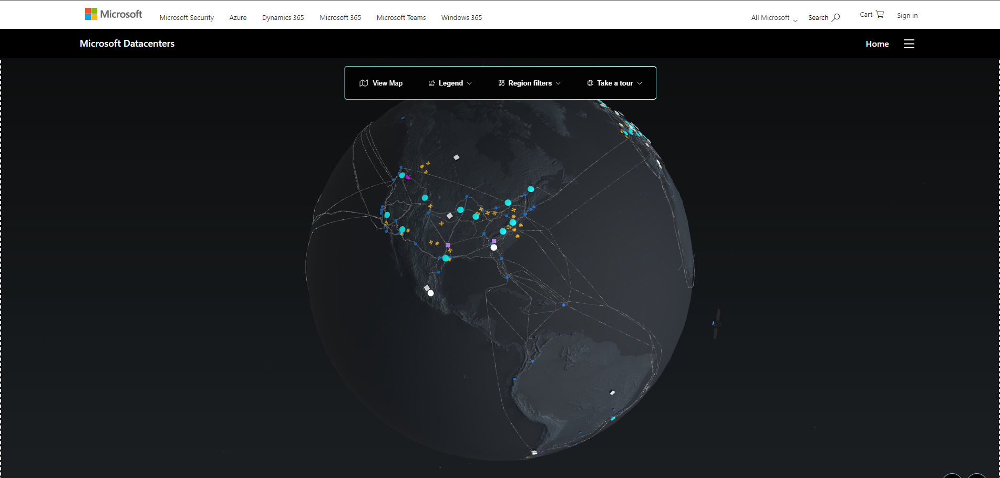

# Lecture 21 Regions Region Pairs Sovereign Regions

Completed the first major objective of the course. Now on to the 2nd.

Describe Arch and Services (35-40%)

Away from other cloud providers and focus on Azure itself.

Core Arch
* Regions, Region Pairs
* Zone of Availability
* datacenters

Storage services

Identity, Access, and Security

Core Azure Architecture Services

Regions
* Areas of the world where Azure has a **set of datacenters** (min 3 in a set)
* Not necessarily "countries" but can be
* Unsually each region is connected to a nother region to make a "region pair"
* Region pairs have highest speed connections and special treatment during azure updates
  * Duplicates have a high prio target because of the "special relationship"

Map:

https://datacenters.microsoft.com/globe/explore

Blue dots for fully active, grey is coming soon

Ex: Canada
* Two regions: Central and East
* Data stored in these regions never leaves Canada
* Anyone can use these regions

Example: Brazil
* Only 1 region, but Chile coming soon
* Paired with South Central US (one way)
  * Backed up
* Data does leave Brazil

EX: Qatar
* 1st region that does not have a pair
* Does not have a GDR - georedundant storage option is not available
* Uses Availability zone for high availability

Example Pairs
* Canada => CA East and West
* Europe => North EU and West EU
* USA => East US and West US
* USA => East US 2 and Central US
* USA => North Central US and South Central US
* Brazil => Brazil South and South Central US

When you create a resource in Azure, you have the choice of where to deploy it
* Pricing can be different

60+ regions but most of them are not available to everyone

Most are not available to everyone, 40 Choices but not all 60. In some regions where you have to be residents, or have to be in a sovereign regions

Sovereign Azure
* Not connected to the Azure public cloud
* Requrie approval to join / create a sub
* Adhere to diff compliance standards

Mission by data class
* Azure Commercial is the public
* Azure Gov
  * Have to be US gov employee
  * DoD Impact level 4 or 5
  * FedRAMP High
  * Other defense stds
* Azure Gov Secret
  * DoD impact level 6
  * ICD 503
  * JSIG (PL-3)
* Azure Gov Top Secret
  * ICD 503
  * ICD 705
  * JSIG (PL-3)
  * Not much public info on this

Azure Regions
* DoD Central, East, Arizona, Texas, Virginia
* Phyiscal isolated from public Azure

Azure Sec (Secret) Regions
* No Phyiscal location given
* No specification of support for service, b/c its a secret

China
* Limited to companies with presence in China
* Have to sign up for an account
