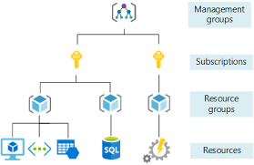

# Lecture 23 Resources and Resource Groups

Resource
* Heirarchy
  * Resource
  * Resouce Groups
  * Subscriptions
  * Management Groups
* A generic word to represent an Azure service that you have access to, such as a specific VM, Storage Account, or DB.
* You can create a resource in many different ways
* Each resource has a name created by you
* Unique with naming convention
* Indicate the region where they are created
  * Take the region setting and drop it in the name slot

All Resource
* A brand new subscription is create with no resources
* Most resources have costs associated with them
* The resource is associate with one (and only one) subscription, to which its cost is billed

Resource Groups
* Folder/Container for grouping resources together
* Assoc with a Region
* All services in a resource group should have a similar lifecycle - deploy together, delete together

Resource & Group
* All resources must belong to one and only one resource group
* Permissions can be assigned at the resource group level
* There is no security boundary offered by resource group for communications

