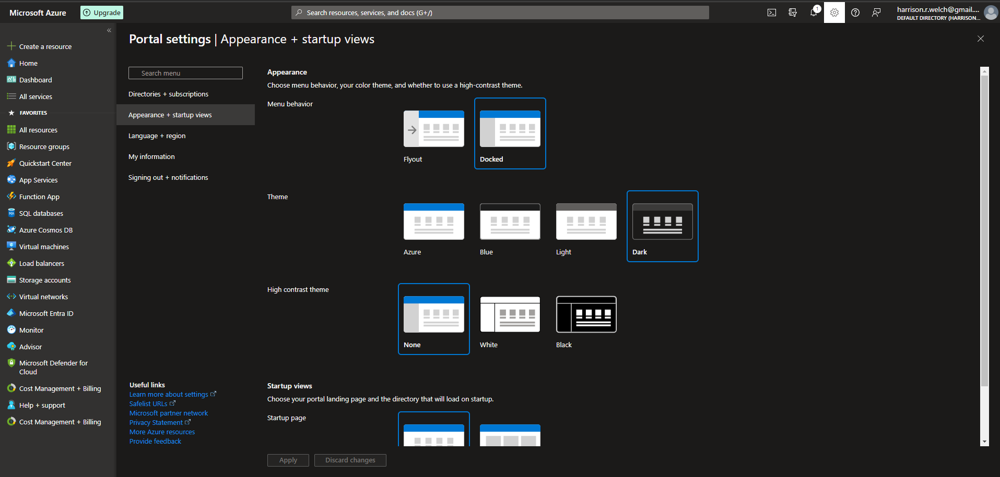
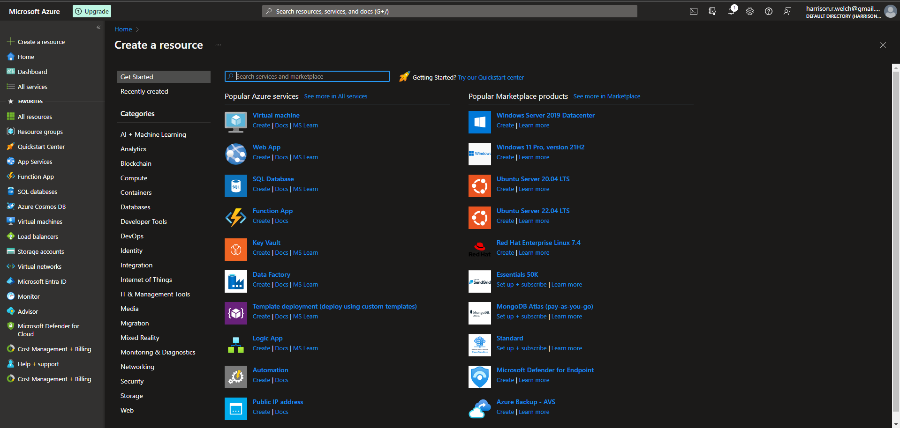
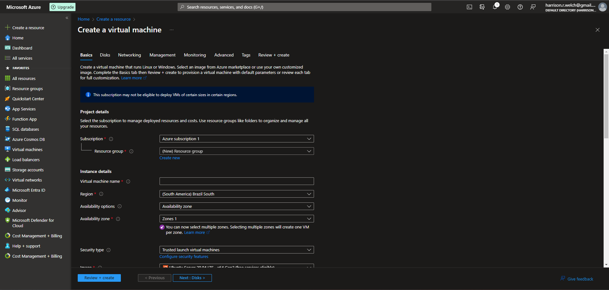
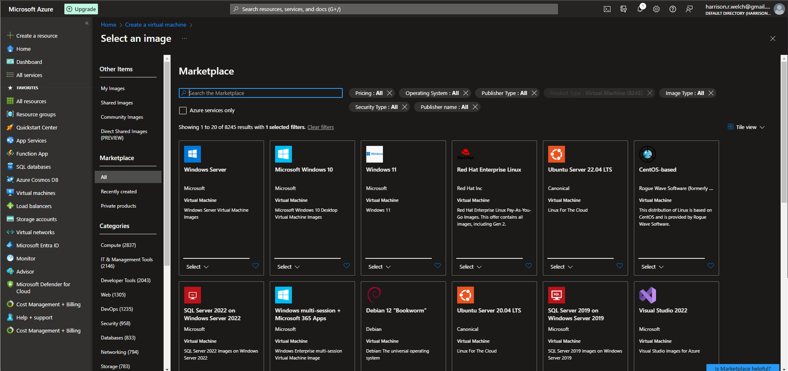
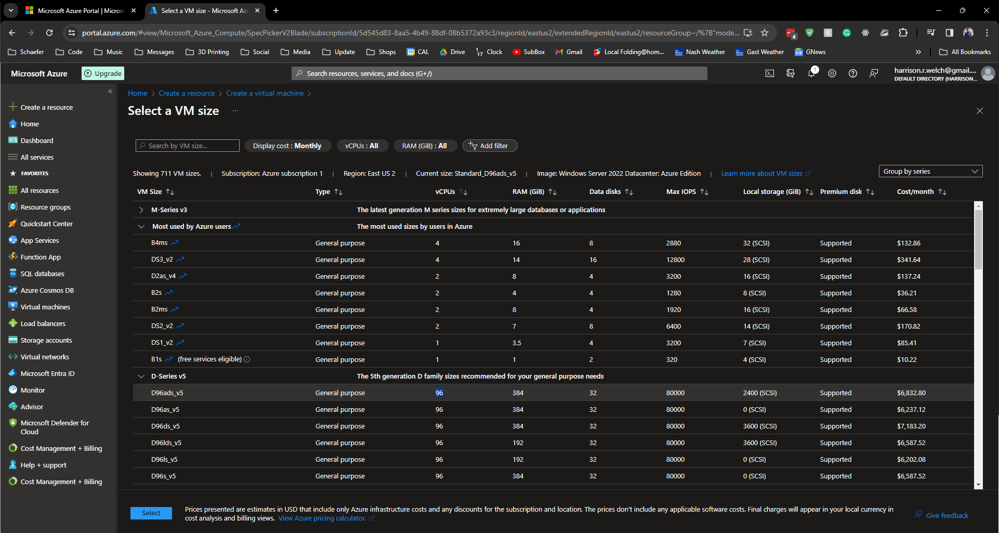
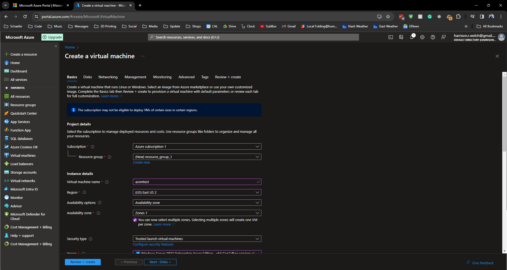
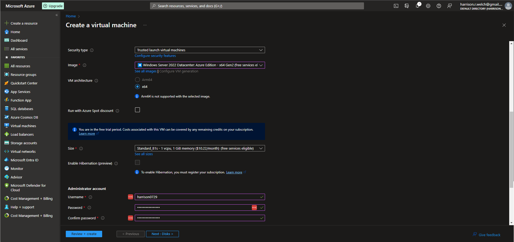
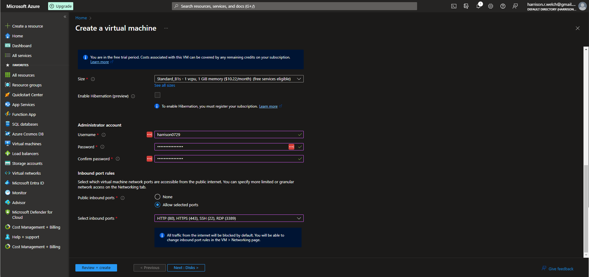
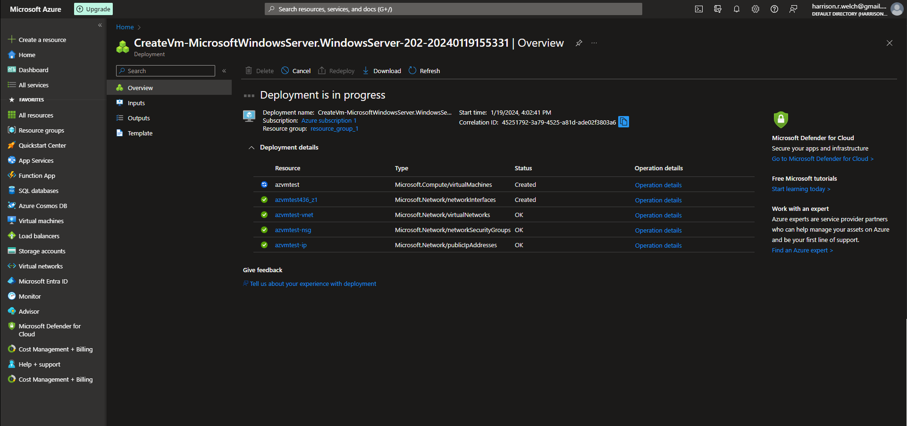
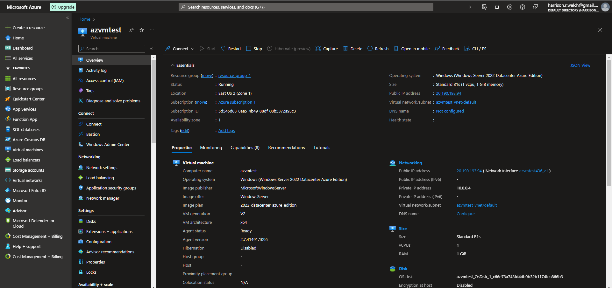

# Lecture 31 LIVE DEMO Creating a Virtual Machine VM

Settings to have the menu "docked" to the left side

VM Create

VM Create details

Choose subscrition

Choose Resource Group

Choose Region
* Pricing implication
  * South Africa will be more imporant than Brazil

Availability Options
  * Control for downtime

Availability
  * Can deploy to multiple zones.

Security set to standard until we need otherwise

Image
* 100s of images to choose from
* SQL Server
* 3rd parties
  * CentOS
  * other Linux distros
* Close out and go to predefined: Win server 2022 Azure edition

Size
* Filters at the top

Admin account

Open up all or most ports here
* Going to turn this into a webserver

Jump to "Review and Create" up at the top
* Gives you the full price
  * 0.0140 USD/hr

Screen shots

Click create

After creation, view result

Overview of new resource (VM)

