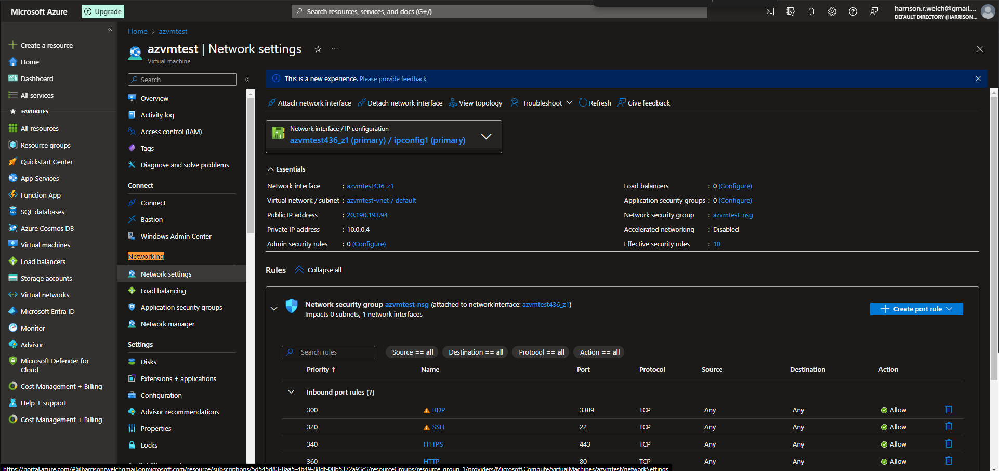
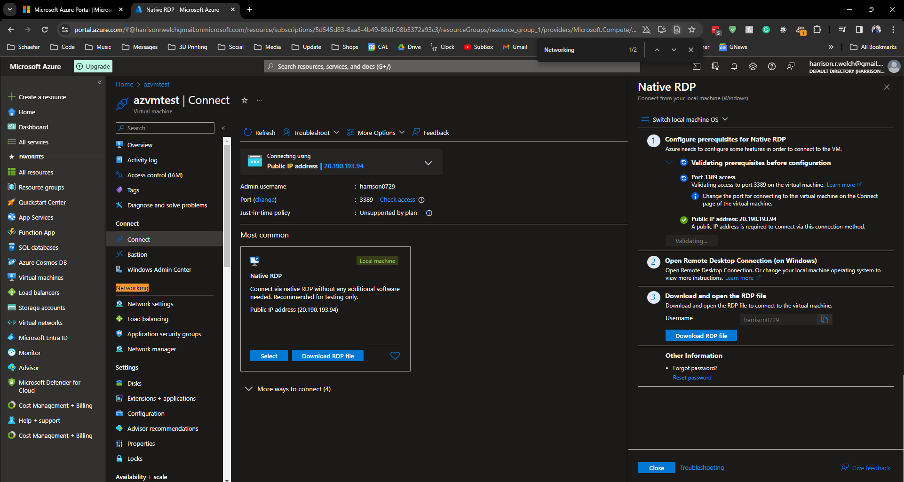
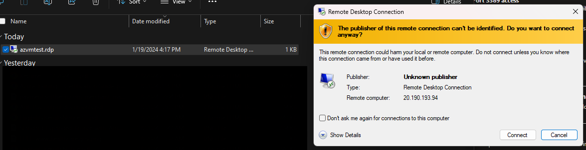
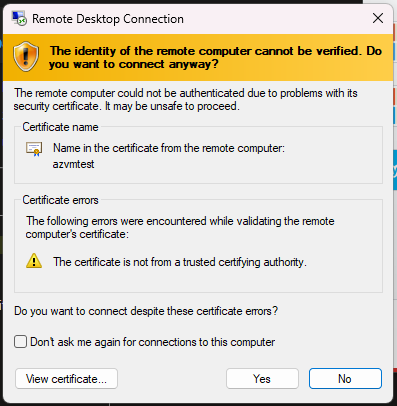
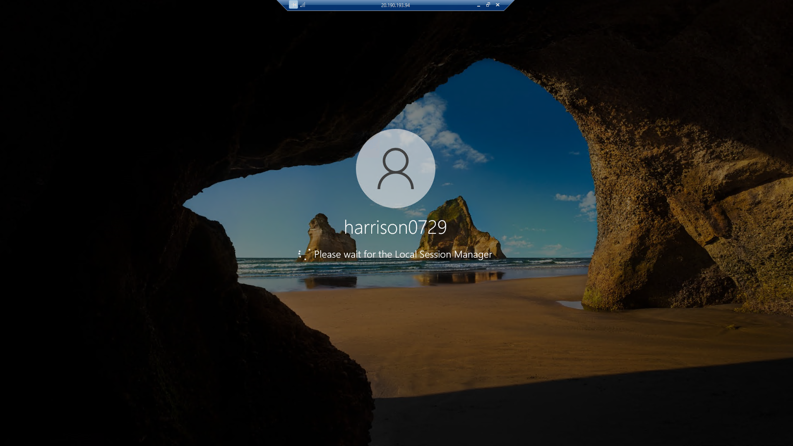
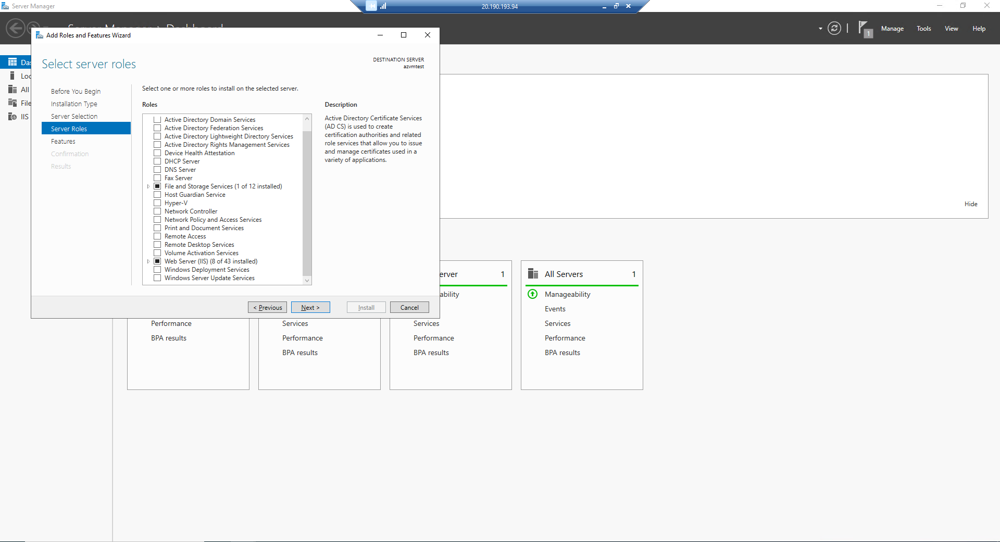
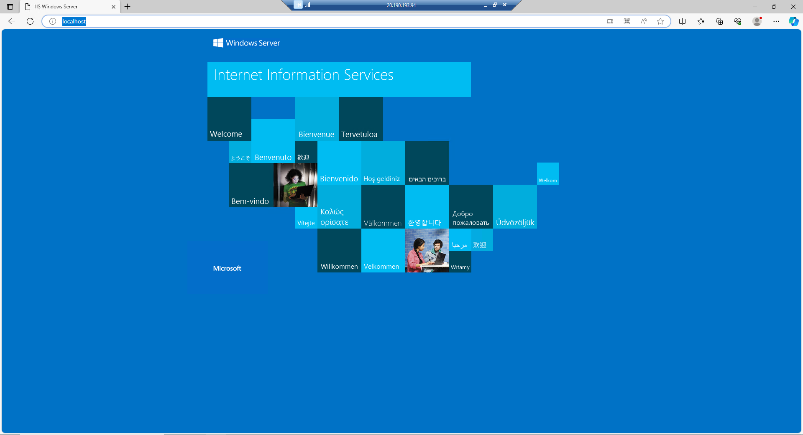

# Lecture 32 LIVE DEMO Connecting to a Virtual Machine

After a few minutes it should create and you have your VM

Show the operational details.

Go to the main resource page to get overview
* Status: Running
* Location: US East 2

Let's show a connection:
* Network settings show a good rule for using RDP

Push connect and Windows RDP from local machine is the most common

After all green check marks -> Download RDP file

Warning of trust, after creation
* I made it so I trust it

Windows server manager
* I want this to be a web server
* Add roles and files
  * Don't need for exam, go further to learn
* Web server IIS role
  * Accept default
  * Could setup FTP server
* Click Install

Now with Azure machine, I can change my mind over and over
* Upgrade to DS2
  * Disrupptive, - restart required

To show the webserver
* Start Edge
* Localhost and show webbrowser running on this machine
* Remember this is a 1 CPU, 3.5 Gib machine
  * Not going to be very fast :(
* localhost returns windows server default return

Server starts pretty barebones

Server Manager boots
* Click "Add Roles and features"

Localhost pulls shows the windows server default. Proof it works!

