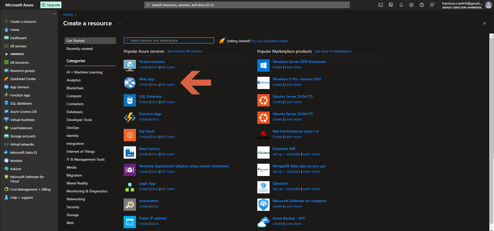
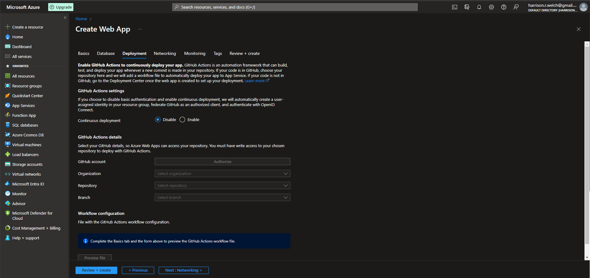
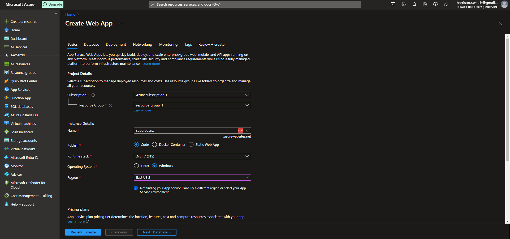
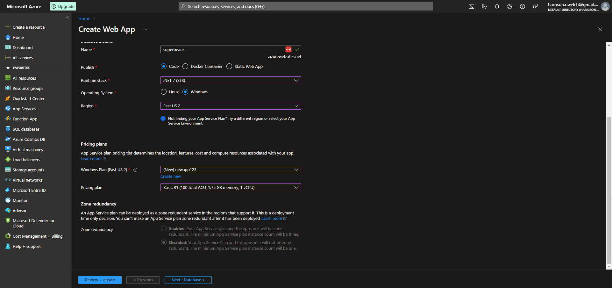
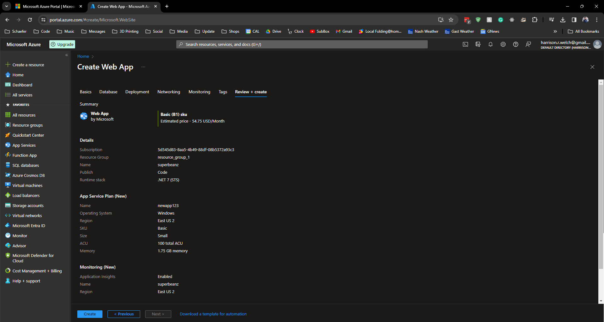

# Lecture 33 LIVE DEMO Creating Azure App Services Web Apps

Web apps now

Platform as a Service

Sub and RG still here like before

Must have a globally unique name
* "superbeanz.azurewebsites.net"

Publish Code
* Java
* Go
* stuff
* Can also use custom handler

Publish as Docker Container or Static Web App

Runtime stack
* Choose code to be handled

Region
* Similar to before

Windows plan
* Create new "newapp123"

Pricing plan
* Free

Explore pricing plans
* Isolated hosting
* Dev test
  * Basic B1 plan
* Production
* ACU means Azure compute units
* Basic B1 is 70 per month

Github automatic deployment

Networking
* Pub vs Priv

Skip Monitoring and Tagging

Create

Had to switch to US East, b/c free subscription did not allow deployment of web app to US East 2 region *shrug*

Web app overview

