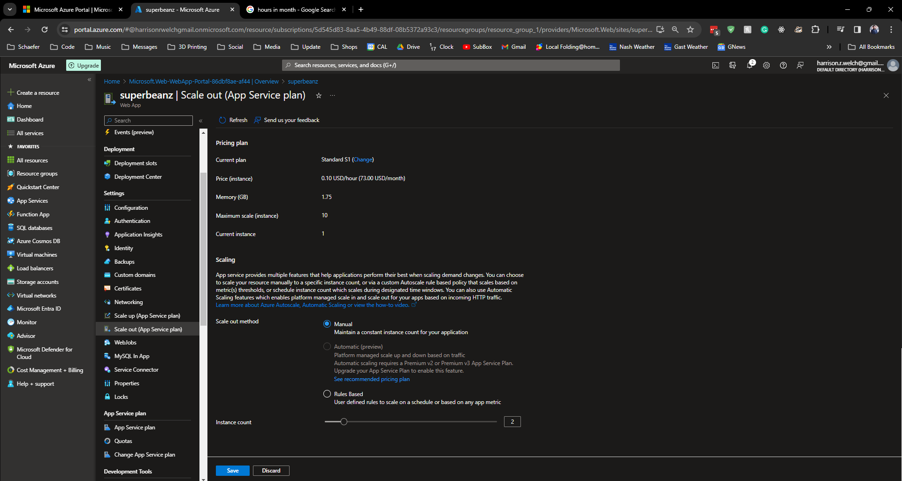

# Lecture 34 LIVE DEMO Azure App Services In Action

Deployment

Overview

Scaling up and scaling out

UP

Select

Upgrades really fast, boom done

Back in overview it now says S1 on the App service plan

Upgrade confirm

OUT

Manual Scaling
* I drag the number of instances

AutoScaling
* Rules based scaling

Rule to increase count if CPU goes above 70

Rule to decrease count if CPU goes below 20

Console
* View here under dev tools

"dir" to see whats in it

Linux commands also work like "ls"

Deployment slots
* Able to swap between them
* Make testing
* AB testing
  * Improvements without sending all traffic
  * Conversion rates

Make slot "staging"

Add a slot

