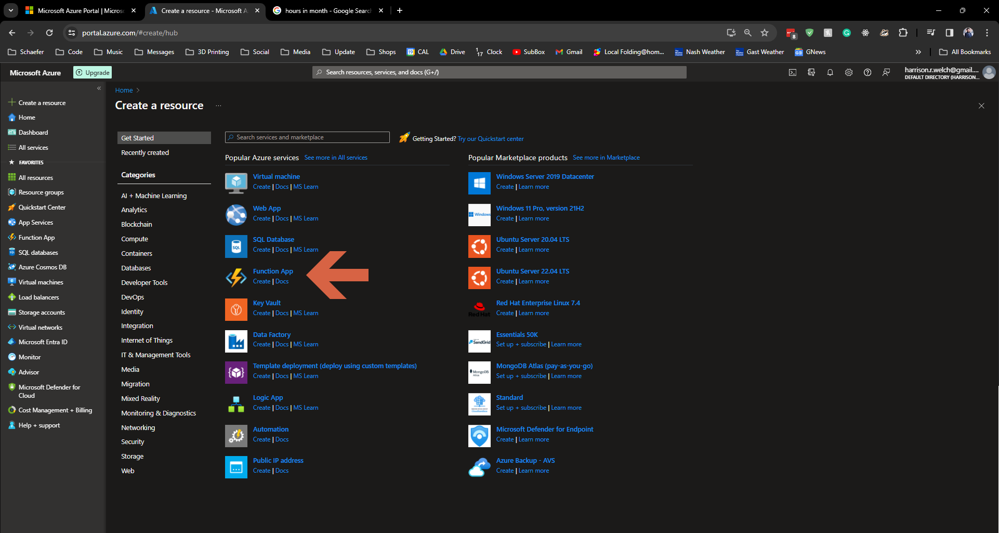
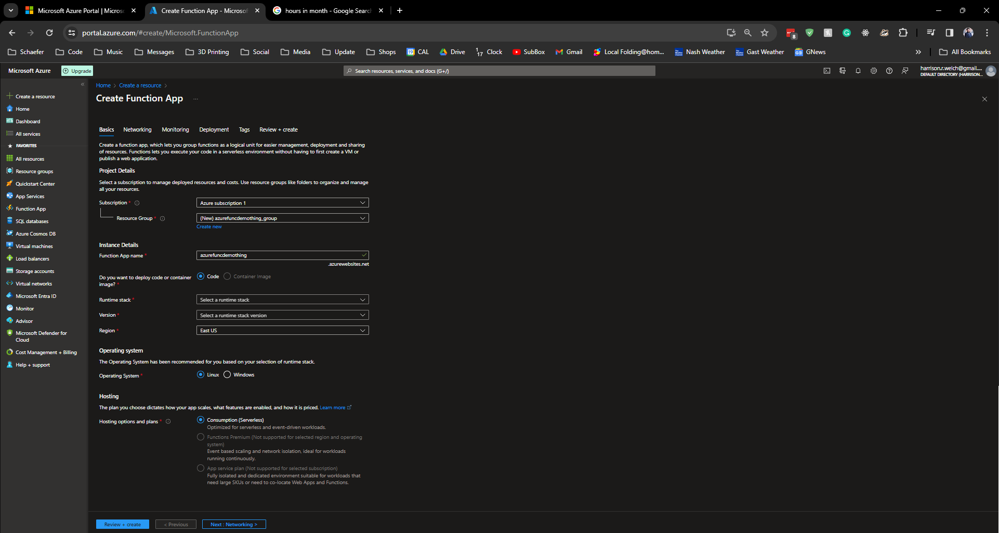
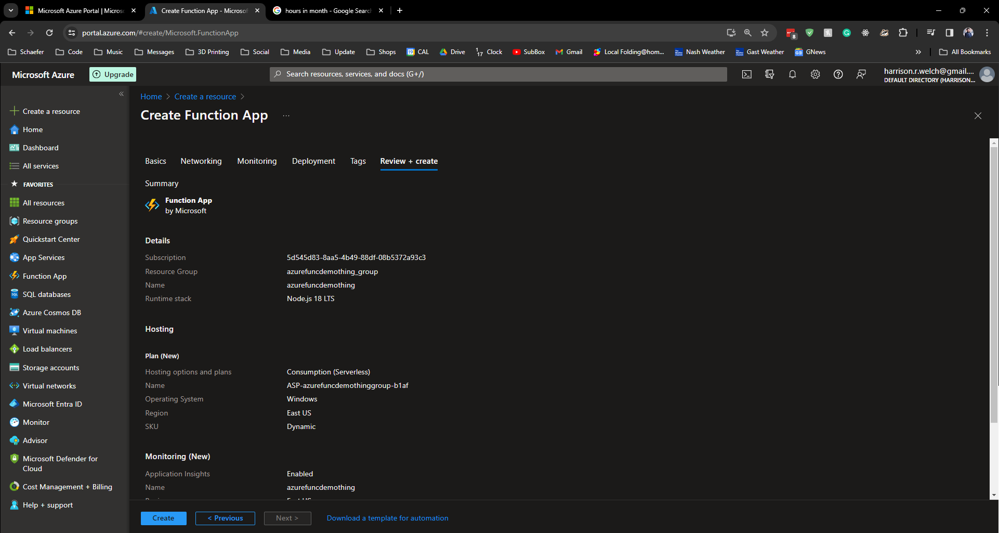
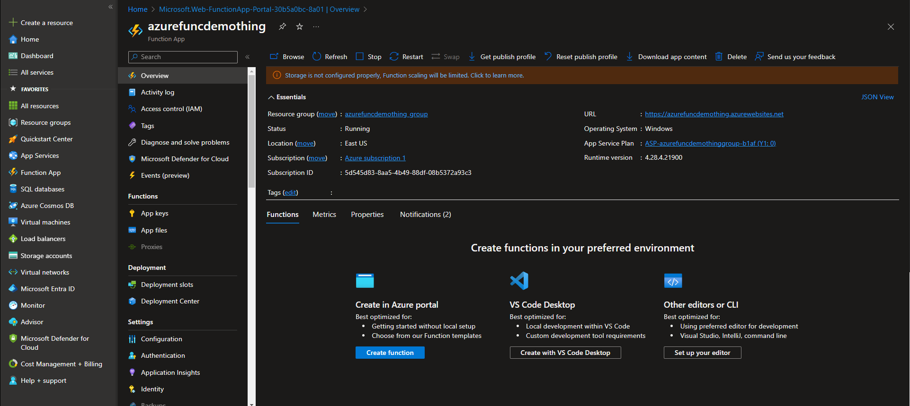
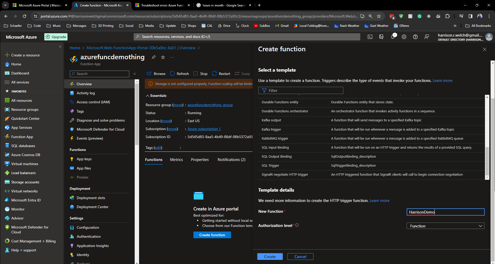
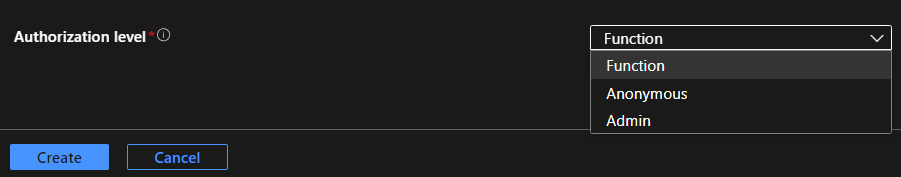
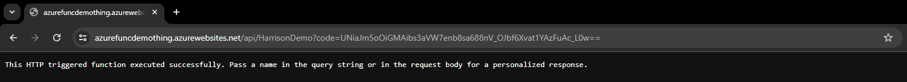

# Lecture 35 LIVE DEMO Creating Azure Functions

Global name again like webapp

Deploy code, container later



Runtime only has a few code
* Customer handler with PHP handler

Version is 18 LTS, leave default

Region East US by default

OS, default is Windows for Node.js stack

Hosting
* Scaling
* Features
* Pricing

Consumption - Azure does everything past code, paying per exections. We choose this
Premium - Premptive scaling, network isolation (For continuous)
App service plan

Storage was in the tutorial, but not in my browser

Networking
* Prem is neede for all option

Monitoring is ok to be off

Deployment
* Could do GitHub continuous development

No Tags



Review + Create



Overview



Now create the app.

You can create the function right in the Azure Portal
* In overview click the large button at the bottom left "Create Function"
* Menu pops up to the right
* Click HTTP trigger
* name the trigger
* Leave the default authorization (used for auth keys for better sec)



Authorization level:



Click Code+Test to the left

```js
module.exports = async function (context, req) {
    context.log('JavaScript HTTP trigger function processed a request.');

    const name = (req.query.name || (req.body && req.body.name));
    const responseMessage = name
        ? "Hello, " + name + ". This HTTP triggered function executed successfully."
        : "This HTTP triggered function executed successfully. Pass a name in the query string or in the request body for a personalized response.";

    context.res = {
        // status: 200, /* Defaults to 200 */
        body: responseMessage
    };
}

```

Looking for a query request with a name prop or a body request with a name prop




Hit this URL:
```
https://azurefuncdemothing.azurewebsites.net/api/HarrisonDemo?code=stuff_and_things==
```

Output
```
This HTTP triggered function executed successfully. Pass a name in the query string or in the request body for a personalized response.
```

Give it a name:
```
https://azurefuncdemothing.azurewebsites.net/api/HarrisonDemo?code=stuff_and_things==&name=Harrison
```

Output
```
Hello, Harrison. This HTTP triggered function executed successfully.
```
