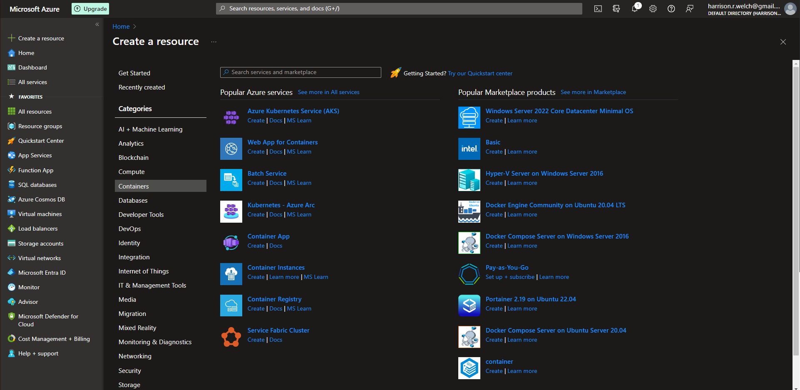
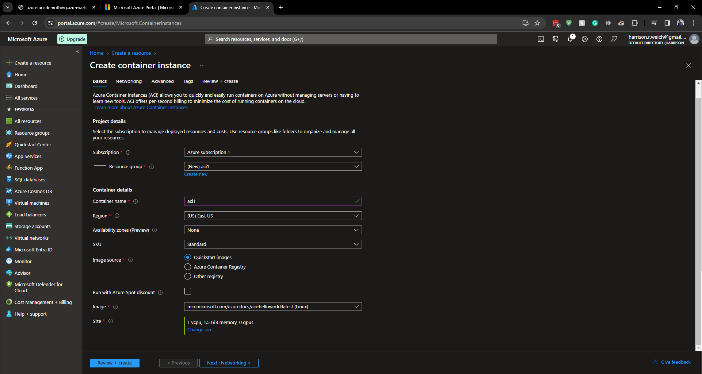
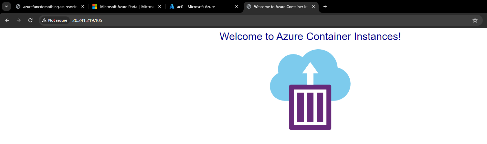

# Lecture 36 LIVE DEMO Kubernetes and Azure Container Instances

Create new Resource ->  Containers

create "Container Instance"
* Not for vital product
* Not great for multi-node, etc stuff

Subscription - Same

Resource Group - (new) acidemo

Container name - azsjdacidemo
* Must be unique

Region - US East

AZ - None

SKU - Standard
* Confidential - not on the exam

Image Source
* Use demo image
* Quickstart images

Run with Azure Spot discount - False

Image
* ...helloworld
* Could use 3rd part registry
* From public repository

Size
* Fairly underpowered
* Type of image

Operation
* 36 seconds

Overview
* No FQDN
  * Fully qualified domain name
* IP Address
  * Click IP to see a hello world

