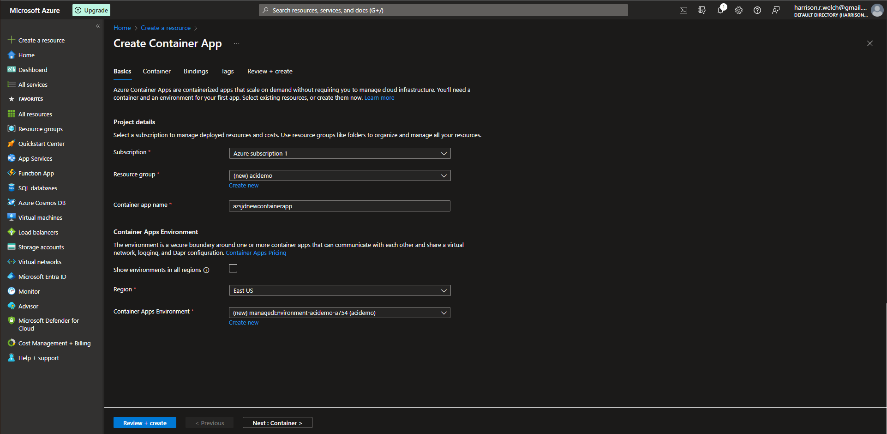

# Lecture 37 LIVE DEMO Azure Container Apps

Quick look at the "Container App"

Create Container App Environment
* Workload or consumption only
* Redundancy

Skip all else and go to Review and Create

This is a more functional app than the container

Container App Settings:

Container App Environments Settings:
* Didn't change anything but shown just incase

We have a URL
* Not just IP address
* Paste it in a web browser - "Container app is live"

Comes with Scaling and replicas
* Scaling rules same with web apps

Don't have to use tools like Kubernetes. Intermediate level between the basic and advanced
