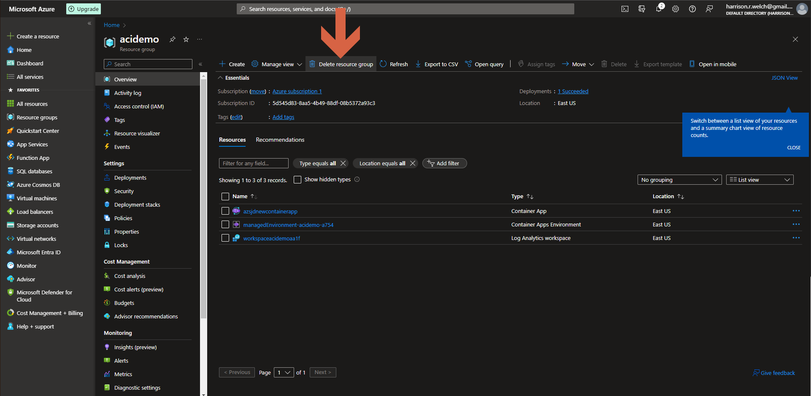
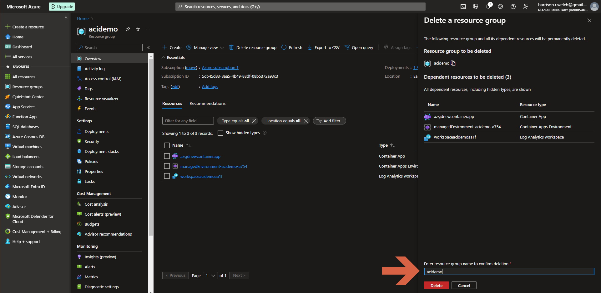

# Lecture 38 Reminder How to Delete Azure Resources

Delete them when your done.

Especially when you're paying for these resources

Name of the resource group
* -> Delete resource group
* Copy paste to confirm
* Press delete
* Can take a few mins

Automatic of "all" things in an entire group regardless of type

Can struggle with backup accounts

Don't __have__ to stop them

