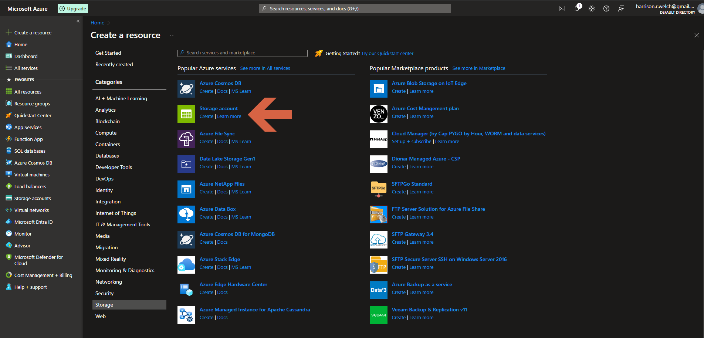
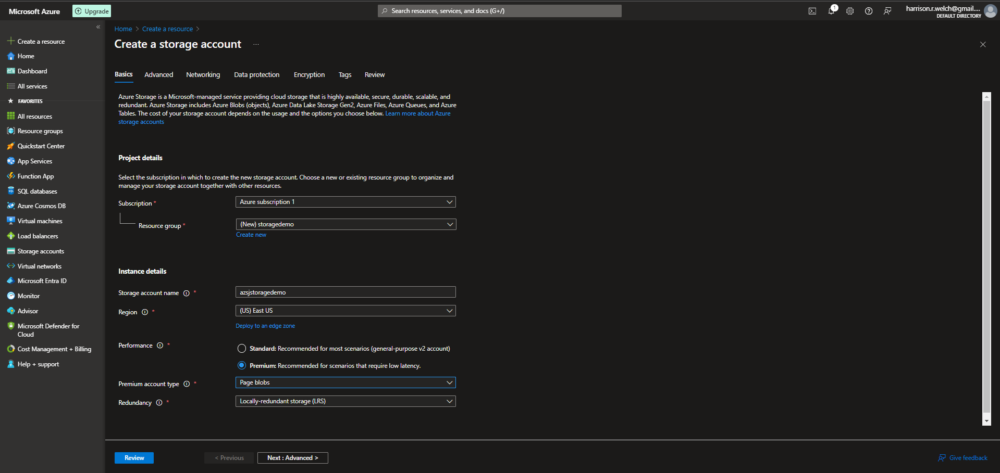
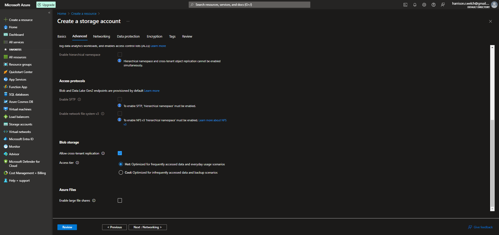
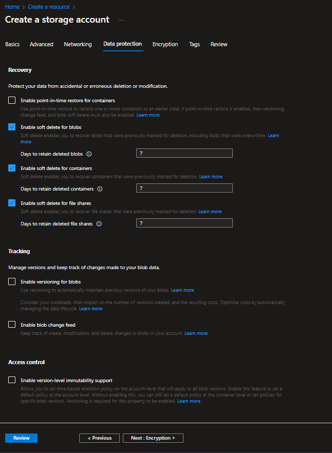
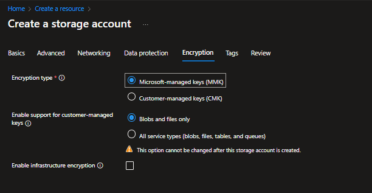
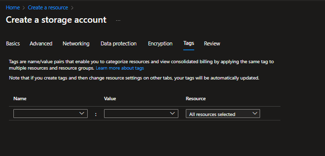
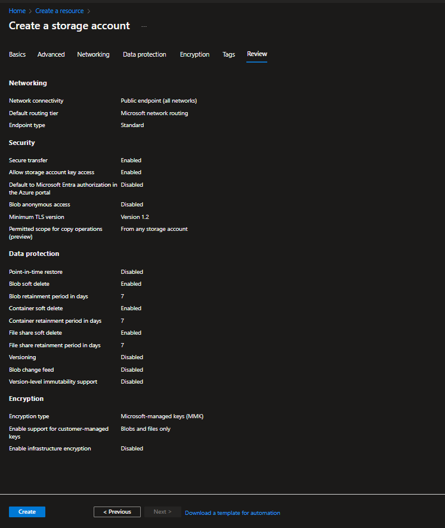

# Lecture 40 LIVE DEMO Create an Unmanaged Storage Account

Lets create a storage account

Geo redundant
* Region. Outside of the region home. Optional read access. Failover in a bit
* Geo-zone redundant. Cost impact.

Storage access using access key

Data Lake Storage
* Proper heirarchal storage

3 access teirs
* Hot
  * Day to day scenario
  * Frequent access
* Cool
  * Save money, cut price in half
  * Pay more in access
  * Infrequently accessed and backup scenarios
* Archive
  * Not seen
  * Put files in a place that is very diff to access
  * 90% storage - hours to access to file, not instance
  * Think of old magnetic tape drives shipped offsite

Leave all defaults in advanced.

Microsoft network routing so that it won't touch the internet until the last minute.

Data Protection
* Enable versioning for blobs
* Enable blob change fee

Access Control
* Enable version-level immutability
  * Legal impact
  * Immutable

Encryption

Tags
* Not much to talk about

Review

Can automate this using scripts.
