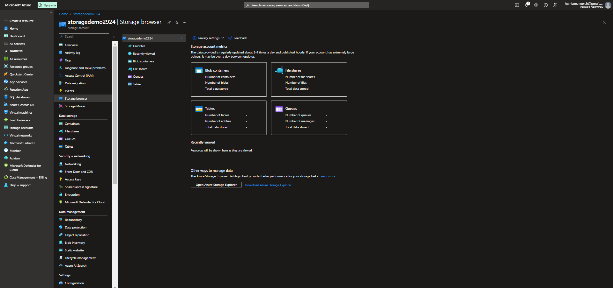
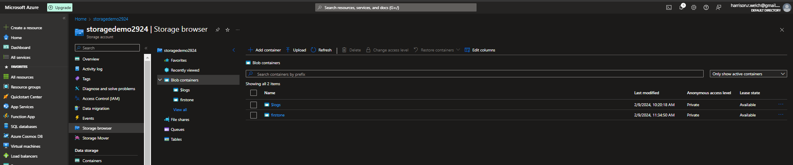

# Lecture 42 LIVE DEMO Azure Storage Explorer and Storage Browser

Last thing, how you access this data

Not meant to access the storage account through the azure login interface

Should not be looking at this as part of production.

It should be programmatic - Write files and such

If you do need to access it we have storage explorer and storage browser

Storage Browser, not mentioned on the AZ900 exam

Storage Explorer, this is on the exam.

BLOB CONTAINERS
* Show all images
* Can get a local app to 
FLIE SHARES
QUEUES
TABLES

Storage explorer will be deprecated in favor of storage browser

Example: 

