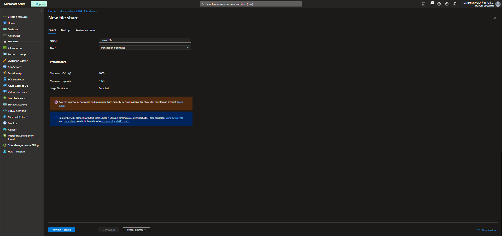

# Lecture 44 Azure File Sync

You still might have a server in the building. May even have a private space that is backed up by the IT dept so you don't have to worry about it.

Microsoft has a "FileShare".

It is possible to have both a file server and a fileShare in the cloud. Almost a centralization b/c multiple offices can use one fileshare

New fileshare example
* IOs 1000
* Egress 60 MiB/s
* Ingress 60 MiB/s

Protocal "SMB"

Basic Concepts
* Storage account
  * SMB 3.1.1 protocol
  * NTLM v2 authentication
  * AES-128-GCM encryption
* Storage Sync Service in Azure
  * Same region as your file server
  * Organized into sync groups
  * Sync groups contain server endpoints
* Azure File Sync Agent
* Optional: self-service restore.

Linux and MS can "mount" these remote drives
* "net use <path>"

Possiblility to restore deleted files from the cloud - if "soft" deleted

Example file share make:

