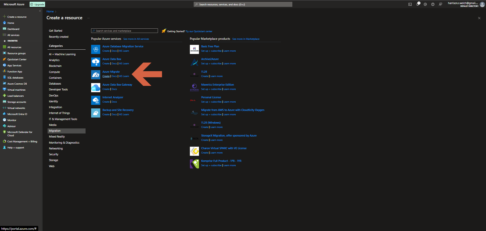
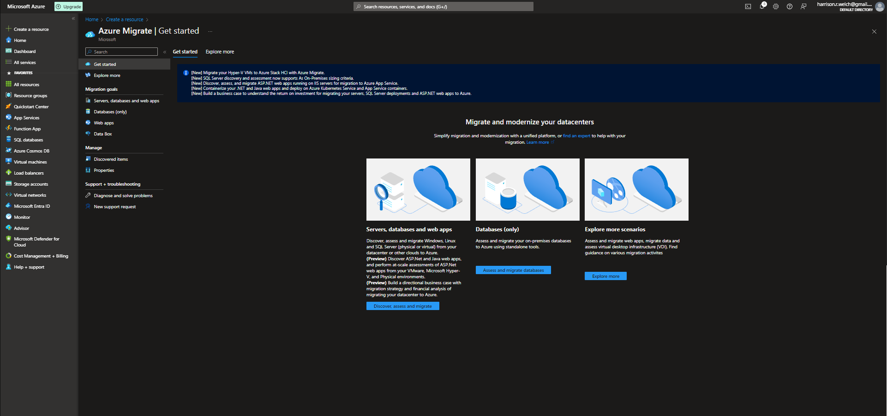

# Lecture 45 Azure Migrate

It may not come as a surprise that MS wants it to be very easy to migrate from local or other cloud providers to Azure. MS makes a guided experience to do this.

Make plans to migrate them into Azure

PLanning and costing things out. Project so that it can be saved and shared with people.

Have checklists and things like that

Will tell you that certain things are going to be ugraded

Some things can be in a old SQL server 3.0 thing.

Red flags and yellow flags will be notified to the user.
