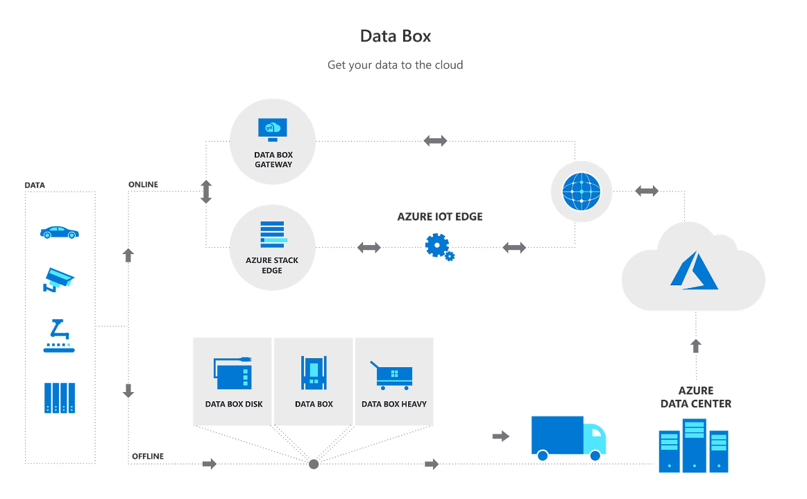
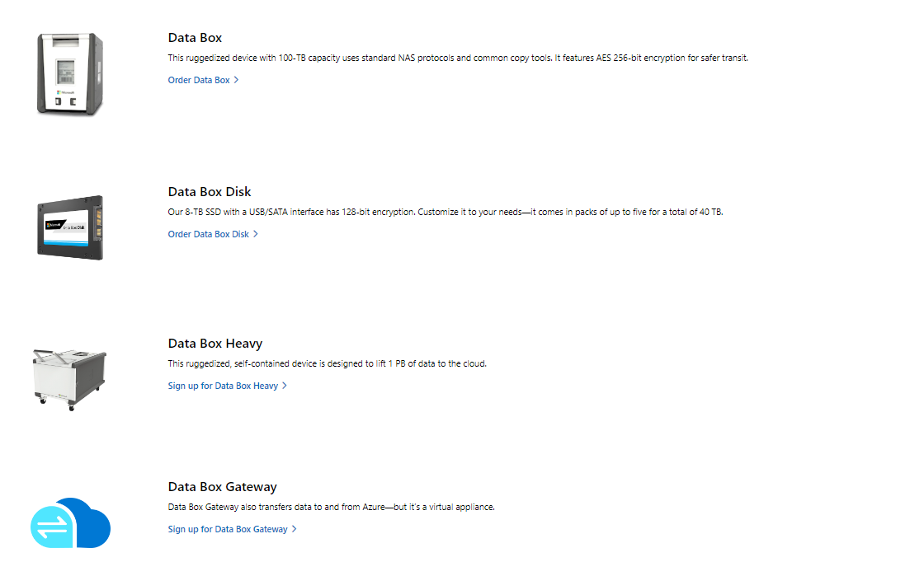

# Lecture 46 Azure Data Box

Challenges when dealing with alot of data. 10s of Terrabytes.

Impractical to upload that much data.

Could get a hardwire connection to Azure.

But if you don't have that, what do you do?

At 64 Mb/s, it takes 11 days to upload 10 TBs.

MS provides alt solutions - Data Boxes.

MS ships you a "data box" load data and ship it back to MS.

Box
* Size of a personal PC tower
Disk
* Single SSD
Heavy
* Cabinet on wheels
* About 10 boxes
* 10 Petabytes

Online is part of the problem.
* Databox Gateway
* Azure Stack Edge

Physically shipping data. Encrpyted, wiped clean after use (guaranteed, non-recoverable)

https://azure.microsoft.com/en-us/products/databox

