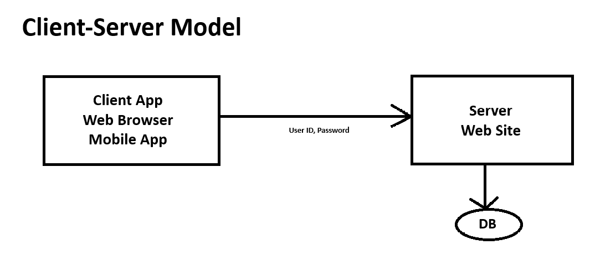
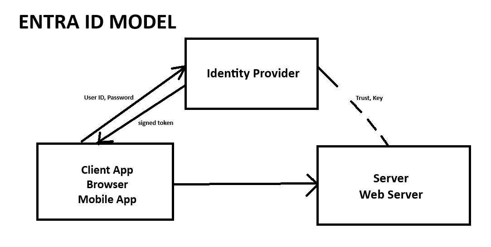

# Lecture 47 Identify and Azure Active Directory

Besides Compute, Network, and Storage. MS also provides some security services.

Fundamental Sec concepts. Prove you are who you say you are.

Stop malicious users

* Describe Azure identity, access, and security.
* Describe directory services - including MS Entra ID and MS Entra Domain Services
* Describe authentication methods in Azure, including single sign-on (SSO), multi-factory auth (MFA) and passwordless
* Describe external identities in Azure, incl biz-2-biz (B2B) and Biz to consumer (B2C)
* Describe MS Entra Conditional Access
* Describe Azure Role based Access control (RBAC)
* Describe the concept of Zero Trust
* Describe the purpose of the defense-in-depth model
* Describe the purpose of MS Defender for Cloud

The concept of Identity
* Employee Pass - name, pic, company you work for, gets access to floors or turn on the printer

In computing, "identity", is a representation of a person, application or device

Examples:
* Name: John Henry Doe
* Email: johndoe@example.com
* Time Entry Application
* The laser printer on the 6th floor
  * The device as an identity - 12 character string ID on the network (example)

Usually requires a password, a secret key or a certificate to prove
* Web app, software

Many applications require you to log in to use some of its functionality
* Certifications (MS Learn) require a login
* But Exam concepts is freely viewable

Client server model
* Client -[creds]-> Server -[lookup]-> DB 
* Hashed value

Roll your own code to handle security
* Don't wont to be responsible
* Don't use something you've created yourself
* Most famous hacks have been done on custom code.

Identity Systems Get Hacked all the time
* Storing password in plain text
  * Bad
* Using outdated (easily broken) encryption like MD5
* Storing the salt with the data
* Not enforcing proper password complexity
* Not enforcing password change policies

People used to think that a password that is very strong is re-usable infinitely. No! Password change policy

MS is a worldwide leader in enterprise ID management with "Active Directory"

They extend their lead in cloud with "Entra ID"

Used to be called "Azure Active Directory" - now called Entra

Active Directory and MS Entra are not direct replacements of each other

Active Directory uses protocol like LDAP and Kerberos for communications - these would never work over the internet

Entra ID uses protocols such as SAML and OAuth for communication over the internet

Instead of coding your own Sec background, you can use APIs to Entra ID to handle authentication and authorizations

Entra ID Model
* Apps, ID provider, Servers
* Order of operations

