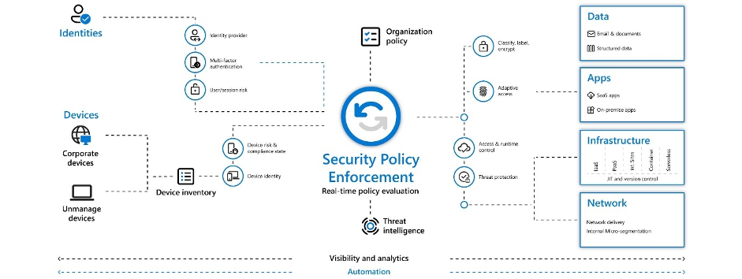

# Lecture 54 Zero-Trust Model of Security

Security of applications

Analogy of a House

Front door and all the windows are locked. Once you have the key to the front door everything is unlocked. Get into any room, cabinet or drawer. Front door is the security threshold.

Apartment. Secure between tennants, shared door.

Zero trust model - lock all the doors of the house. Lock all cupboard.

Key to every room, key to the closet.

Don't assume everything behind the wall is safe. Don't trust each other. One application needs to security into the other. Certificate or key

Zero Trust
* Verify explicitly
* Use least privledged access
* Assume breach

Hacker cannot intercept all things based on breach one wall

Use every available method to validate identity and authorization

JIT - Just in Time
* Only allowed to have the admin privledges at a time for a short~ish period of time
* Elevated permissions just in time

JEA - Just enough access
* Minimum accessed required
* Don't overprovision people

Security even inside the network; encryption, segmentation, thread detection

Account has been accessed with wrong password too many times. = 24 hr ban

Example, Hacker can get in get the entire data
* Point where you get suspicious and block access

Identity: Verify and secure each identity

Devices: ensure compliance and health status
* Browser is Out of date

Applications: appropriate in-app permissions, monitor user actions
* Big downloads like code-base or accounts table etc

Data: encryption and protection of data

Infrastructure: robust monitoring to detect attacks, block and flag risky behavior
* Set alert
* MS has some tools to investigating and building a case for fraud

Encryption
